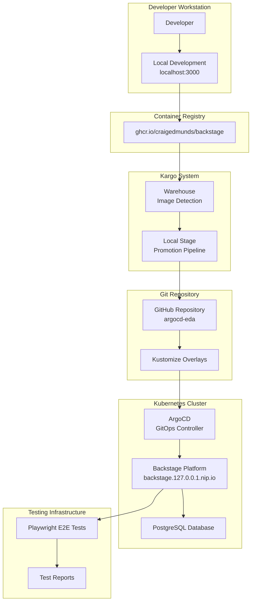

# Backstage Platform Design Document

## Overview

The Backstage platform is a comprehensive developer portal system built on the open-source Backstage framework. It provides a unified interface for software catalog management, developer tooling, and automated deployment workflows. The system integrates with GitHub for authentication and repository management, uses Kargo for GitOps-based promotions, and includes comprehensive testing infrastructure using Playwright for end-to-end validation.

The platform follows a microservices architecture with a React frontend, Node.js backend, PostgreSQL database, and Kubernetes-native deployment model. It supports both local development and production deployment scenarios with environment-specific configurations managed through Kustomize overlays.

## Architecture

### High-Level Architecture



### Component Architecture

The Backstage platform consists of several key components:

1. **Frontend Application**: React-based single-page application providing the user interface
2. **Backend Services**: Node.js services handling API requests, authentication, and integrations
3. **Database Layer**: PostgreSQL for persistent data storage
4. **Plugin System**: Modular architecture supporting custom plugins and extensions
5. **Integration Layer**: Connectors for GitHub, container registries, and Kubernetes

## Components and Interfaces

### Frontend Components

- **Catalog Browser**: Interface for browsing and searching software entities
- **Entity Pages**: Detailed views for individual components, systems, and resources
- **Scaffolder**: Template-based project creation interface
- **Authentication**: GitHub OAuth integration for user authentication
- **Navigation**: Sidebar navigation and routing system

### Backend Services

- **Catalog Service**: Manages software entities and their relationships
- **Scaffolder Service**: Handles template processing and project creation
- **Auth Service**: Manages authentication and authorization
- **Proxy Service**: Handles external API integrations
- **Plugin Services**: Custom business logic for specialized functionality

### Integration Interfaces

- **GitHub API**: Repository access, user authentication, and webhook management
- **Container Registry API**: Image metadata and version information
- **Kubernetes API**: Cluster information and resource discovery
- **Kargo API**: Promotion status and workflow management

## Data Models

### Core Entities

```typescript
interface Component {
  apiVersion: string;
  kind: 'Component';
  metadata: {
    name: string;
    namespace?: string;
    title?: string;
    description?: string;
    labels?: Record<string, string>;
    annotations?: Record<string, string>;
  };
  spec: {
    type: string;
    lifecycle: string;
    owner: string;
    system?: string;
    subcomponentOf?: string;
    providesApis?: string[];
    consumesApis?: string[];
    dependsOn?: string[];
  };
}

interface System {
  apiVersion: string;
  kind: 'System';
  metadata: EntityMetadata;
  spec: {
    owner: string;
    domain?: string;
  };
}

interface API {
  apiVersion: string;
  kind: 'API';
  metadata: EntityMetadata;
  spec: {
    type: string;
    lifecycle: string;
    owner: string;
    system?: string;
    definition: string;
  };
}
```

### Configuration Models

```typescript
interface BackstageConfig {
  app: {
    title: string;
    baseUrl: string;
  };
  backend: {
    baseUrl: string;
    auth: {
      keys: Array<{ secret: string }>;
    };
    cors: {
      origin: string;
      credentials: boolean;
      methods: string[];
    };
  };
  integrations: {
    github: Array<{
      host: string;
      token: string;
    }>;
  };
  catalog: {
    locations: CatalogLocation[];
    providers?: Record<string, any>;
  };
}

interface KargoPromotion {
  warehouse: string;
  stage: string;
  freight: {
    images: Array<{
      repository: string;
      tag: string;
    }>;
  };
  steps: PromotionStep[];
}
```

## Correctness Properties

*A property is a characteristic or behavior that should hold true across all valid executions of a system-essentially, a formal statement about what the system should do. Properties serve as the bridge between human-readable specifications and machine-verifiable correctness guarantees.*

Based on the prework analysis, I'll consolidate related properties to eliminate redundancy:

**Property Reflection:**
- Properties 3.1-3.5 (E2E test behaviors) can be combined into comprehensive test execution properties
- Properties 4.1-4.2 (proxy configuration) can be combined into general integration configuration
- Properties 6.1-6.5 (monitoring and error handling) can be streamlined to focus on core error handling patterns

**Property 1: Catalog entity display consistency**
*For any* software entity in the catalog, when displayed in the catalog interface, it should show proper metadata including name, type, owner, and relationships
**Validates: Requirements 1.3**

**Property 2: Image promotion pipeline**
*For any* new Backstage image published to the container registry that meets semver constraints, the Kargo system should automatically detect, promote, and update git repositories with the new image tag
**Validates: Requirements 2.1, 2.2, 2.3**

**Property 3: Deployment accessibility**
*For any* successful ArgoCD deployment, the Backstage platform should be accessible and responsive at the configured endpoint
**Validates: Requirements 2.4**

**Property 4: E2E test execution**
*For any* completed deployment, E2E tests should execute successfully and report detailed results with pass/fail status for navigation, catalog, and entity functionality
**Validates: Requirements 3.1, 3.2, 3.3, 3.4, 3.5**

**Property 5: Integration configuration**
*For any* external integration (GitHub, container registries), the platform should support proper proxy configuration with authentication
**Validates: Requirements 4.1, 4.2**

**Property 6: Catalog location management**
*For any* configured catalog location, the platform should successfully load entities and support template-based operations
**Validates: Requirements 4.4**

**Property 7: Secret handling**
*For any* sensitive configuration data, the platform should use environment variables and never expose secrets in logs or responses
**Validates: Requirements 4.5**

**Property 8: Template execution**
*For any* valid software template, the scaffolder should execute successfully, generate proper project structures, and register entities in the catalog
**Validates: Requirements 5.2, 5.3, 5.4**

**Property 9: GitHub repository creation**
*For any* scaffolding operation using GitHub integration, the platform should create repositories and configure webhooks properly
**Validates: Requirements 5.5**

**Property 10: Error handling and retry logic**
*For any* integration failure or system error, the platform should implement appropriate retry mechanisms and provide diagnostic information
**Validates: Requirements 6.2, 6.4**

**Property 11: System health reporting**
*For any* health check request, the platform should report the status of all integrated components accurately
**Validates: Requirements 6.5**

**Property 12: ConfigMap code elimination**
*For any* ConfigMap in the Kargo configuration, it should not contain embedded executable code (Python, shell scripts, etc.)
**Validates: Requirements 7.1**

**Property 13: Script organization**
*For any* script needed for verification, it should be stored in dedicated script directories with proper file extensions and accessed via volume mounts
**Validates: Requirements 7.2, 7.3**

**Property 14: Analysis template uniqueness**
*For any* verification purpose, there should be exactly one analysis template serving that purpose
**Validates: Requirements 7.4**

**Property 15: E2E test execution reliability**
*For any* Kargo verification run, E2E tests should execute successfully and produce accessible reports and artifacts stored in the mounted artifacts directory
**Validates: Requirements 8.1, 8.2**

**Property 16: Test failure visibility**
*For any* E2E test failure, the failure information should be clearly visible in Kargo promotion status and debugging artifacts should be accessible
**Validates: Requirements 8.3, 8.4**

**Property 17: Git workflow integration**
*For any* configuration change, it should be easily reviewable through standard Git diff and review processes
**Validates: Requirements 8.5**

## Error Handling

### Error Categories

1. **Integration Errors**: GitHub API failures, container registry timeouts, Kubernetes connectivity issues
2. **Deployment Errors**: ArgoCD sync failures, Kargo promotion failures, image pull errors
3. **Application Errors**: Plugin loading failures, database connectivity issues, authentication failures
4. **Test Errors**: E2E test failures, timeout errors, browser automation issues

### Error Handling Strategies

- **Retry Logic**: Exponential backoff for transient failures with configurable retry limits
- **Circuit Breakers**: Prevent cascading failures by temporarily disabling failing integrations
- **Graceful Degradation**: Continue operating with reduced functionality when non-critical services fail
- **Error Reporting**: Structured logging with correlation IDs for distributed tracing
- **Health Checks**: Regular monitoring of all system components with alerting

### Recovery Mechanisms

- **Automatic Recovery**: Self-healing for transient issues like network connectivity
- **Manual Intervention**: Clear error messages and diagnostic information for complex failures
- **Rollback Capabilities**: Ability to revert to previous working configurations
- **State Reconciliation**: Periodic validation and correction of system state

## Testing Strategy

### Dual Testing Approach

The system employs both unit testing and property-based testing to ensure comprehensive coverage:

- **Unit tests** verify specific examples, edge cases, and error conditions
- **Property tests** verify universal properties that should hold across all inputs
- Together they provide comprehensive coverage: unit tests catch concrete bugs, property tests verify general correctness

### Unit Testing

Unit tests focus on:
- Specific component behaviors and API responses
- Integration points between services
- Error handling for known failure scenarios
- Configuration validation and parsing
- Authentication and authorization flows

### Property-Based Testing

Property-based testing uses **fast-check** for JavaScript/TypeScript to verify system properties:
- Each property-based test runs a minimum of 100 iterations
- Tests generate random inputs within valid domains
- Properties are tagged with comments referencing design document properties
- Tag format: **Feature: backstage, Property {number}: {property_text}**

**Property-Based Test Requirements:**
- Use fast-check library for property-based testing in TypeScript
- Configure each test to run minimum 100 iterations
- Tag each test with exact format: '**Feature: backstage, Property {number}: {property_text}**'
- Each correctness property must be implemented by a single property-based test
- Focus on universal behaviors that should hold across all valid inputs

### End-to-End Testing

E2E tests use Playwright to validate complete user workflows:
- Platform accessibility and responsiveness
- Navigation and user interface functionality
- Catalog browsing and entity management
- Authentication and authorization flows
- Integration with external services

### Integration Testing

Integration tests verify:
- GitHub API integration and authentication
- Container registry connectivity and image metadata
- Kubernetes cluster communication
- Database operations and data persistence
- Kargo promotion pipeline execution

### Test Environment Management

- **Local Development**: Tests run against local development servers
- **CI/CD Pipeline**: Automated test execution with proper environment setup
- **Test Data**: Isolated test data and cleanup procedures
- **Test Reporting**: HTML reports with screenshots and detailed failure information

## Kargo Configuration Consolidation

### Current Issues Analysis

The existing Kargo configuration in `kustomize/backstage-kargo/` has several structural problems:

1. **Code in ConfigMaps**: Python scripts and shell scripts are embedded directly in `configmap.yaml`
2. **Duplicate Templates**: Multiple analysis templates (`analysis-template.yaml`, `e2e-analysis-template.yaml`, `backstage-e2e-verification.yaml`) serve overlapping purposes
3. **Manual Files**: Files like `manual-freight.yaml` and `manual-promotion.yaml` have unclear purposes
4. **Broken E2E Execution**: The current E2E test execution doesn't work reliably

### Consolidation Strategy

#### Script Externalization

Move all embedded scripts from ConfigMaps to proper file structures:

```
kustomize/backstage-kargo/
├── scripts/
│   ├── e2e-runner.py           # Main E2E test execution script
│   ├── setup-environment.sh   # Environment setup script
│   └── health-check.sh         # Basic health check script
├── templates/
│   └── backstage-verification.yaml  # Single consolidated analysis template
└── resources/
    ├── warehouse.yaml
    ├── stage-local.yaml
    └── project.yaml
```

#### Template Consolidation

Replace multiple analysis templates with a single parameterized template:

```yaml
apiVersion: argoproj.io/v1alpha1
kind: AnalysisTemplate
metadata:
  name: backstage-verification
  namespace: backstage-kargo
spec:
  args:
    - name: backstage-url
    - name: verification-type
      value: "full"  # Options: health, e2e, full
  metrics:
    - name: health-check
      when: "{{args.verification-type}} in ['health', 'full']"
      # Health check logic
    - name: e2e-tests
      when: "{{args.verification-type}} in ['e2e', 'full']"
      # E2E test execution using external scripts
```

#### Resource Organization

- **Remove manual files**: Delete `manual-freight.yaml` and `manual-promotion.yaml` unless they serve a documented testing purpose
- **Consolidate similar resources**: Merge overlapping functionality
- **Clear naming**: Use descriptive names that indicate purpose

#### E2E Test Integration

Implement reliable E2E test execution:

1. **External Script Storage**: Store test scripts in `scripts/` directory
2. **Container Image**: Use a proper base image with required dependencies pre-installed
3. **Volume Mounts**: Mount scripts as volumes rather than embedding in ConfigMaps
4. **Artifact Collection**: Store E2E test outputs (reports, screenshots, traces) in volume mounted to `/Users/craig/src/hmrc-eis/eda/argocd-eda/.backstage-e2e-artifacts`
5. **Error Reporting**: Ensure test failures are properly reported to Kargo

### Implementation Approach

1. **Phase 1**: Extract scripts from ConfigMaps to external files
2. **Phase 2**: Consolidate duplicate analysis templates
3. **Phase 3**: Remove or document manual files
4. **Phase 4**: Fix E2E test execution
5. **Phase 5**: Validate and test the consolidated configuration

### Benefits

- **Maintainability**: Scripts can be edited and version-controlled properly
- **Clarity**: Single source of truth for each verification type
- **Reliability**: Proper E2E test execution with artifact collection
- **GitOps Compliance**: Configuration follows Kubernetes and GitOps best practices
- **Debuggability**: Clear separation between configuration and implementation