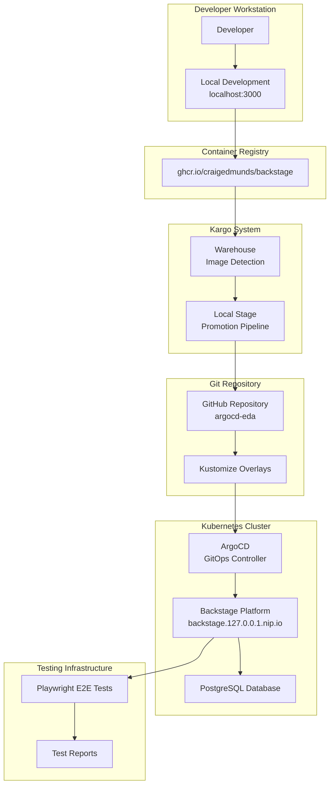
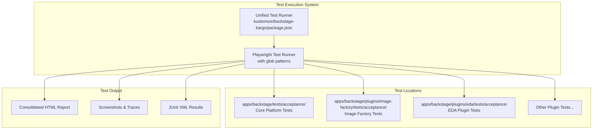
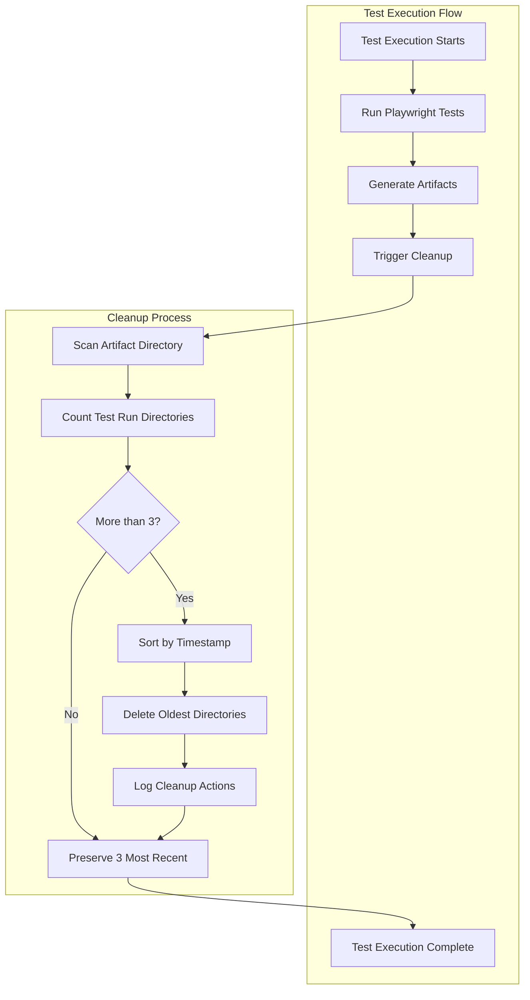

# Backstage Platform Design Document

## Overview

The Backstage platform is a comprehensive developer portal system built on the open-source Backstage framework. It provides a unified interface for software catalog management, developer tooling, and automated deployment workflows. The system integrates with GitHub for authentication and repository management, uses Kargo for GitOps-based promotions, and includes comprehensive testing infrastructure using Playwright for end-to-end validation.

The platform follows a microservices architecture with a React frontend, Node.js backend, PostgreSQL database, and Kubernetes-native deployment model. It supports both local development and production deployment scenarios with environment-specific configurations managed through Kustomize overlays.

## Architecture

### High-Level Architecture



### Component Architecture

The Backstage platform consists of several key components:

1. **Frontend Application**: React-based single-page application providing the user interface
2. **Backend Services**: Node.js services handling API requests, authentication, and integrations
3. **Database Layer**: PostgreSQL for persistent data storage
4. **Plugin System**: Modular architecture supporting custom plugins and extensions
5. **Integration Layer**: Connectors for GitHub, container registries, and Kubernetes

## Components and Interfaces

### Frontend Components

- **Catalog Browser**: Interface for browsing and searching software entities
- **Entity Pages**: Detailed views for individual components, systems, and resources
- **Scaffolder**: Template-based project creation interface
- **Authentication**: GitHub OAuth integration for user authentication
- **Navigation**: Sidebar navigation and routing system

### Backend Services

- **Catalog Service**: Manages software entities and their relationships
- **Scaffolder Service**: Handles template processing and project creation
- **Auth Service**: Manages authentication and authorization
- **Proxy Service**: Handles external API integrations
- **Plugin Services**: Custom business logic for specialized functionality

### Integration Interfaces

- **GitHub API**: Repository access, user authentication, and webhook management
- **Container Registry API**: Image metadata and version information
- **Kubernetes API**: Cluster information and resource discovery
- **Kargo API**: Promotion status and workflow management

## Data Models

### Core Entities

```typescript
interface Component {
  apiVersion: string;
  kind: 'Component';
  metadata: {
    name: string;
    namespace?: string;
    title?: string;
    description?: string;
    labels?: Record<string, string>;
    annotations?: Record<string, string>;
  };
  spec: {
    type: string;
    lifecycle: string;
    owner: string;
    system?: string;
    subcomponentOf?: string;
    providesApis?: string[];
    consumesApis?: string[];
    dependsOn?: string[];
  };
}

interface System {
  apiVersion: string;
  kind: 'System';
  metadata: EntityMetadata;
  spec: {
    owner: string;
    domain?: string;
  };
}

interface API {
  apiVersion: string;
  kind: 'API';
  metadata: EntityMetadata;
  spec: {
    type: string;
    lifecycle: string;
    owner: string;
    system?: string;
    definition: string;
  };
}
```

### Configuration Models

```typescript
interface BackstageConfig {
  app: {
    title: string;
    baseUrl: string;
  };
  backend: {
    baseUrl: string;
    auth: {
      keys: Array<{ secret: string }>;
    };
    cors: {
      origin: string;
      credentials: boolean;
      methods: string[];
    };
  };
  integrations: {
    github: Array<{
      host: string;
      token: string;
    }>;
  };
  catalog: {
    locations: CatalogLocation[];
    providers?: Record<string, any>;
  };
}

interface KargoPromotion {
  warehouse: string;
  stage: string;
  freight: {
    images: Array<{
      repository: string;
      tag: string;
    }>;
  };
  steps: PromotionStep[];
}
```

### Artifact Management Models

```typescript
interface TestRunDirectory {
  path: string;
  timestamp: Date;
  name: string;
  size: number;
}

interface ArtifactCleanupConfig {
  retentionCount: number;           // Number of test runs to retain (default: 3)
  artifactDirectory: string;        // Base artifacts directory path
  cleanupEnabled: boolean;          // Enable/disable automatic cleanup
  concurrentSafety: boolean;        // Enable file locking for concurrent runs
}

interface CleanupResult {
  removedDirectories: string[];
  preservedDirectories: string[];
  errors: Error[];
  success: boolean;
  executionTime: number;
}

interface TestEnvironmentConfig {
  PLAYWRIGHT_ARTIFACTS_DIR: string;
  PLAYWRIGHT_SCREENSHOTS_DIR: string;
  PLAYWRIGHT_VIDEOS_DIR: string;
  PLAYWRIGHT_TRACES_DIR: string;
  PLAYWRIGHT_HTML_REPORT_DIR: string;
  TEST_RUN_ID: string;
}
```

## Correctness Properties

*A property is a characteristic or behavior that should hold true across all valid executions of a system-essentially, a formal statement about what the system should do. Properties serve as the bridge between human-readable specifications and machine-verifiable correctness guarantees.*

Based on the prework analysis, I'll consolidate related properties to eliminate redundancy:

**Property Reflection:**
- Properties 3.1-3.5 (E2E test behaviors) can be combined into comprehensive test execution properties
- Properties 4.1-4.2 (proxy configuration) can be combined into general integration configuration
- Properties 6.1-6.5 (monitoring and error handling) can be streamlined to focus on core error handling patterns

**Property 1: Catalog entity display consistency**
*For any* software entity in the catalog, when displayed in the catalog interface, it should show proper metadata including name, type, owner, and relationships
**Validates: Requirements 1.3**

**Property 2: Image promotion pipeline**
*For any* new Backstage image published to the container registry that meets semver constraints, the Kargo system should automatically detect, promote, and update git repositories with the new image tag
**Validates: Requirements 2.1, 2.2, 2.3**

**Property 3: Deployment accessibility**
*For any* successful ArgoCD deployment, the Backstage platform should be accessible and responsive at the configured endpoint
**Validates: Requirements 2.4**

**Property 4: Acceptance test execution**
*For any* completed deployment, acceptance tests should execute successfully and report detailed results with pass/fail status for navigation, catalog, and entity functionality
**Validates: Requirements 3.1, 3.2, 3.3, 3.4, 3.5**

**Property 5: Integration configuration**
*For any* external integration (GitHub, container registries), the platform should support proper proxy configuration with authentication
**Validates: Requirements 4.1, 4.2**

**Property 6: Catalog location management**
*For any* configured catalog location, the platform should successfully load entities and support template-based operations
**Validates: Requirements 4.4**

**Property 7: Secret handling**
*For any* sensitive configuration data, the platform should use environment variables and never expose secrets in logs or responses
**Validates: Requirements 4.5**

**Property 8: Template execution**
*For any* valid software template, the scaffolder should execute successfully, generate proper project structures, and register entities in the catalog
**Validates: Requirements 5.2, 5.3, 5.4**

**Property 9: GitHub repository creation**
*For any* scaffolding operation using GitHub integration, the platform should create repositories and configure webhooks properly
**Validates: Requirements 5.5**

**Property 10: Error handling and retry logic**
*For any* integration failure or system error, the platform should implement appropriate retry mechanisms and provide diagnostic information
**Validates: Requirements 6.2, 6.4**

**Property 11: System health reporting**
*For any* health check request, the platform should report the status of all integrated components accurately
**Validates: Requirements 6.5**

**Property 12: ConfigMap code elimination**
*For any* ConfigMap in the Kargo configuration, it should not contain embedded executable code (Python, shell scripts, etc.)
**Validates: Requirements 7.1**

**Property 13: Script organization**
*For any* script needed for verification, it should be stored in dedicated script directories with proper file extensions and accessed via volume mounts
**Validates: Requirements 7.2, 7.3**

**Property 14: Analysis template uniqueness**
*For any* verification purpose, there should be exactly one analysis template serving that purpose
**Validates: Requirements 7.4**

**Property 15: Test discovery and execution**
*For any* test execution via the unified test runner, all relevant acceptance tests should be discovered and executed from both centralized and plugin-specific directories
**Validates: Requirements 8.1**

**Property 16: Kargo test integration**
*For any* Kargo verification run, acceptance tests should execute successfully against the deployed Backstage instance
**Validates: Requirements 8.2**

**Property 17: Test isolation and consolidated reporting**
*For any* distributed test suite execution, tests should maintain proper isolation while producing consolidated reports with clear traceability of test locations
**Validates: Requirements 8.3, 8.4**

**Property 18: Test failure reporting**
*For any* test failure, the failure information should be clearly visible in Kargo promotion status and debugging artifacts should be easily accessible
**Validates: Requirements 8.5**

**Property 19: Artifact retention policy**
*For any* test execution completion, the system should automatically retain only the 3 most recent test run directories and delete older directories based on timestamp
**Validates: Requirements 9.1, 9.2**

**Property 20: Cleanup directory integrity**
*For any* artifact cleanup operation, the system should preserve directory structure and only remove complete test run directories while logging removed directories for audit
**Validates: Requirements 9.3, 9.4**

**Property 21: Cleanup error handling**
*For any* cleanup process failure, the system should continue test execution and log the failure without blocking tests
**Validates: Requirements 9.5**

**Property 22: Centralized environment variable usage**
*For any* plugin test execution, tests should use central environment variables for artifact storage path configuration and fail with clear error messages when variables are missing
**Validates: Requirements 10.1, 10.2**

**Property 23: Artifact storage consistency**
*For any* test artifact capture, artifacts should be stored in paths specified by central environment variables with consistent configuration across all plugins
**Validates: Requirements 10.3, 10.4, 10.5**

**Property 24: Test failure feedback quality**
*For any* image factory test failure, the test should provide clear feedback about which user functionality is broken
**Validates: Requirements 11.3**

**Property 25: Integrated cleanup execution**
*For any* unified test runner execution, artifact cleanup should be automatically triggered after test completion without interfering with result reporting
**Validates: Requirements 12.1, 12.2**

**Property 26: Environment-independent cleanup**
*For any* test execution environment (local, CI, Kargo), artifact cleanup should work correctly and ensure recent artifacts remain accessible
**Validates: Requirements 12.3, 12.4**

**Property 27: Concurrent cleanup safety**
*For any* simultaneous test runs, artifact cleanup should handle concurrent access safely without corruption
**Validates: Requirements 12.5**

## Error Handling

### Error Categories

1. **Integration Errors**: GitHub API failures, container registry timeouts, Kubernetes connectivity issues
2. **Deployment Errors**: ArgoCD sync failures, Kargo promotion failures, image pull errors
3. **Application Errors**: Plugin loading failures, database connectivity issues, authentication failures
4. **Test Errors**: Acceptance test failures, timeout errors, browser automation issues

### Error Handling Strategies

- **Retry Logic**: Exponential backoff for transient failures with configurable retry limits
- **Circuit Breakers**: Prevent cascading failures by temporarily disabling failing integrations
- **Graceful Degradation**: Continue operating with reduced functionality when non-critical services fail
- **Error Reporting**: Structured logging with correlation IDs for distributed tracing
- **Health Checks**: Regular monitoring of all system components with alerting

### Recovery Mechanisms

- **Automatic Recovery**: Self-healing for transient issues like network connectivity
- **Manual Intervention**: Clear error messages and diagnostic information for complex failures
- **Rollback Capabilities**: Ability to revert to previous working configurations
- **State Reconciliation**: Periodic validation and correction of system state

## Testing Strategy

### Dual Testing Approach

The system employs both unit testing and property-based testing to ensure comprehensive coverage:

- **Unit tests** verify specific examples, edge cases, and error conditions
- **Property tests** verify universal properties that should hold across all inputs
- Together they provide comprehensive coverage: unit tests catch concrete bugs, property tests verify general correctness

### Unit Testing

Unit tests focus on:
- Specific component behaviors and API responses
- Integration points between services
- Error handling for known failure scenarios
- Configuration validation and parsing
- Authentication and authorization flows

### Property-Based Testing

Property-based testing uses **fast-check** for JavaScript/TypeScript to verify system properties:
- Each property-based test runs a minimum of 100 iterations
- Tests generate random inputs within valid domains
- Properties are tagged with comments referencing design document properties
- Tag format: **Feature: backstage, Property {number}: {property_text}**

**Property-Based Test Requirements:**
- Use fast-check library for property-based testing in TypeScript
- Configure each test to run minimum 100 iterations
- Tag each test with exact format: '**Feature: backstage, Property {number}: {property_text}**'
- Each correctness property must be implemented by a single property-based test
- Focus on universal behaviors that should hold across all valid inputs

### End-to-End Testing

Acceptance tests use Playwright to validate complete user workflows:
- Platform accessibility and responsiveness
- Navigation and user interface functionality
- Catalog browsing and entity management
- Authentication and authorization flows
- Integration with external services

### Integration Testing

Integration tests verify:
- GitHub API integration and authentication
- Container registry connectivity and image metadata
- Kubernetes cluster communication
- Database operations and data persistence
- Kargo promotion pipeline execution

### Test Environment Management

- **Local Development**: Tests run against local development servers
- **CI/CD Pipeline**: Automated test execution with proper environment setup
- **Test Data**: Isolated test data and cleanup procedures
- **Test Reporting**: HTML reports with screenshots and detailed failure information

## Kargo Configuration Consolidation

### Current Issues Analysis

The existing Kargo configuration in `kustomize/backstage-kargo/` has several structural problems:

1. **Code in ConfigMaps**: Python scripts and shell scripts are embedded directly in `configmap.yaml`
2. **Duplicate Templates**: Multiple analysis templates (`analysis-template.yaml`, `e2e-analysis-template.yaml`, `backstage-e2e-verification.yaml`) serve overlapping purposes
3. **Manual Files**: Files like `manual-freight.yaml` and `manual-promotion.yaml` have unclear purposes
4. **Broken Acceptance Test Execution**: The current acceptance test execution doesn't work reliably

### Consolidation Strategy

#### Script Externalization

Move all embedded scripts from ConfigMaps to proper file structures:

```
kustomize/backstage-kargo/
├── scripts/
│   ├── acceptance-test-runner.py  # Main acceptance test execution script
│   ├── setup-environment.sh   # Environment setup script
│   └── health-check.sh         # Basic health check script
├── templates/
│   └── backstage-verification.yaml  # Single consolidated analysis template
└── resources/
    ├── warehouse.yaml
    ├── stage-local.yaml
    └── project.yaml
```

#### Template Consolidation

Replace multiple analysis templates with a single parameterized template:

```yaml
apiVersion: argoproj.io/v1alpha1
kind: AnalysisTemplate
metadata:
  name: backstage-verification
  namespace: backstage-kargo
spec:
  args:
    - name: backstage-url
    - name: verification-type
      value: "full"  # Options: health, e2e, full
  metrics:
    - name: health-check
      when: "{{args.verification-type}} in ['health', 'full']"
      # Health check logic
    - name: acceptance-tests
      when: "{{args.verification-type}} in ['acceptance', 'full']"
      # Acceptance test execution using external scripts
```

#### Resource Organization

- **Remove manual files**: Delete `manual-freight.yaml` and `manual-promotion.yaml` unless they serve a documented testing purpose
- **Consolidate similar resources**: Merge overlapping functionality
- **Clear naming**: Use descriptive names that indicate purpose

#### Acceptance Test Integration

Implement reliable acceptance test execution:

1. **External Script Storage**: Store test scripts in `scripts/` directory
2. **Container Image**: Use a proper base image with required dependencies pre-installed
3. **Volume Mounts**: Mount scripts as volumes rather than embedding in ConfigMaps
4. **Artifact Collection**: Store acceptance test outputs (reports, screenshots, traces) in volume mounted to `/Users/craig/src/hmrc-eis/eda/argocd-eda/.backstage-e2e-artifacts`
5. **Error Reporting**: Ensure test failures are properly reported to Kargo

### Implementation Approach

1. **Phase 1**: Extract scripts from ConfigMaps to external files
2. **Phase 2**: Consolidate duplicate analysis templates
3. **Phase 3**: Remove or document manual files
4. **Phase 4**: Fix acceptance test execution
5. **Phase 5**: Validate and test the consolidated configuration

### Benefits

- **Maintainability**: Scripts can be edited and version-controlled properly
- **Clarity**: Single source of truth for each verification type
- **Reliability**: Proper acceptance test execution with artifact collection
- **GitOps Compliance**: Configuration follows Kubernetes and GitOps best practices
- **Debuggability**: Clear separation between configuration and implementation

## Test Organization Architecture

### Current Test Distribution Challenge

The Backstage platform has acceptance tests distributed across multiple locations:

1. **Centralized Tests**: `apps/backstage/tests/acceptance/` - Core platform functionality tests
2. **Plugin Tests**: `apps/backstage/plugins/*/tests/acceptance/` - Plugin-specific functionality tests
3. **Kargo Integration**: `kustomize/backstage-kargo/package.json` - Unified test execution entry point

### Unified Test Execution System

The test organization solution uses Playwright's built-in glob pattern matching to execute tests across multiple directories:

#### Test Execution Strategy



#### Implementation Approach

1. **Playwright Configuration**: Single `playwright.config.ts` with glob patterns covering all test directories
2. **Pattern Matching**: Use patterns like `apps/backstage/**/tests/acceptance/**/*.spec.ts`
3. **Native Reporting**: Leverage Playwright's built-in HTML reporter and artifact collection
4. **Simple Orchestration**: Single command execution with consolidated output

#### Directory Structure

```
apps/backstage/
├── tests/acceptance/           # Centralized acceptance tests
│   ├── basic.spec.ts          # Core platform functionality
│   ├── events.spec.ts         # Events catalog functionality
│   └── package.json           # Test dependencies
├── plugins/
│   ├── image-factory/
│   │   └── tests/acceptance/  # Image factory specific tests
│   │       ├── enrollment.test.ts
│   │       └── template.test.ts
│   └── eda/
│       └── tests/acceptance/  # EDA plugin specific tests
│           └── events.test.ts
└── ...

kustomize/backstage-kargo/
├── package.json               # Unified test runner entry point
├── playwright.config.ts       # Playwright configuration with glob patterns
├── scripts/
│   └── test-runner.py         # Simple test execution wrapper
└── ...
```

#### Test Execution Flow

1. **Pattern Matching**: Playwright uses glob patterns to find all test files across directories
2. **Execution**: Single Playwright command runs all discovered tests
3. **Reporting**: Playwright generates consolidated HTML report with test results
4. **Artifacts**: Screenshots, traces, and other artifacts collected automatically

#### Playwright Configuration Example

```typescript
// playwright.config.ts
export default {
  testDir: '../../apps/backstage',
  testMatch: [
    'tests/acceptance/**/*.spec.ts',           // Central tests
    'plugins/**/tests/acceptance/**/*.spec.ts' // Plugin tests
  ],
  reporter: [
    ['html', { outputFolder: 'test-results/html-report' }],
    ['junit', { outputFile: 'test-results/results.xml' }]
  ],
  use: {
    screenshot: 'only-on-failure',
    trace: 'retain-on-failure'
  }
};
```

### Integration with Kargo Verification

The test execution system integrates seamlessly with Kargo verification workflows:

1. **Trigger**: Kargo promotion triggers unified test execution via `npm run test:docker`
2. **Pattern Matching**: Playwright automatically finds all tests using configured glob patterns
3. **Execution**: All tests run against deployed Backstage instance in single command
4. **Reporting**: Consolidated results feed back to Kargo promotion status
5. **Artifacts**: Test artifacts stored in mounted volume for debugging

### Benefits of Playwright-Based Test Organization

- **Simple Configuration**: Uses Playwright's native glob pattern matching
- **Single Command**: One `playwright test` command executes all relevant tests
- **Comprehensive Coverage**: Glob patterns ensure no tests are missed
- **Maintainable**: Plugin teams can add tests without changing central configuration
- **Native Reporting**: Leverages Playwright's built-in HTML reporter and artifact collection
- **Scalable**: Adding new plugins automatically includes their tests via patterns
- **No Custom Code**: Eliminates need for custom discovery and orchestration logic

## Local Acceptance Test Artifact Management Architecture

### Local Environment Artifact Storage Strategy

The system manages acceptance test artifacts in the local development environment through a centralized storage and cleanup mechanism that ensures disk space efficiency while maintaining debugging capabilities. This design focuses specifically on local artifact management - production-like cluster artifacts are handled by a separate e2e-artifact-management system that extracts and persists artifacts from remote environments.

#### Artifact Directory Structure

```
.backstage-e2e-artifacts/
├── backstage-acceptance-20251215-161003/    # Most recent run
│   ├── artifacts/
│   │   ├── screenshots/
│   │   ├── videos/
│   │   └── traces/
│   ├── html-report/
│   └── results.json
├── backstage-acceptance-20251215-143022/    # Second most recent
│   └── ...
├── backstage-acceptance-20251215-120145/    # Third most recent
│   └── ...
└── [older directories automatically cleaned up]
```

#### Retention Policy Implementation



### Environment Variable Configuration

#### Centralized Configuration Model

All plugin tests use a standardized set of environment variables for artifact storage:

```typescript
interface TestEnvironmentConfig {
  PLAYWRIGHT_ARTIFACTS_DIR: string;          // Base artifacts directory
  PLAYWRIGHT_SCREENSHOTS_DIR: string;       // Screenshot storage path
  PLAYWRIGHT_VIDEOS_DIR: string;           // Video storage path
  PLAYWRIGHT_TRACES_DIR: string;           // Trace storage path
  PLAYWRIGHT_HTML_REPORT_DIR: string;      // HTML report output path
  TEST_RUN_ID: string;                     // Unique test run identifier
}
```

#### Plugin Test Integration

Each plugin test configuration inherits from central environment variables:

```typescript
// Plugin test configuration example
export default defineConfig({
  use: {
    screenshot: 'only-on-failure',
    video: 'retain-on-failure',
    trace: 'retain-on-failure'
  },
  reporter: [
    ['html', { 
      outputFolder: process.env.PLAYWRIGHT_HTML_REPORT_DIR || 'test-results/html-report' 
    }],
    ['junit', { 
      outputFile: `${process.env.PLAYWRIGHT_ARTIFACTS_DIR}/results.xml` 
    }]
  ],
  projects: [
    {
      name: 'image-factory-tests',
      testDir: './tests/acceptance',
      use: {
        // Inherits global artifact storage configuration
      }
    }
  ]
});
```

### Cleanup Implementation Strategy

#### Cleanup Service Architecture

```typescript
interface ArtifactCleanupService {
  // Core cleanup operations
  scanArtifactDirectory(): Promise<TestRunDirectory[]>;
  identifyOldestDirectories(directories: TestRunDirectory[], keepCount: number): TestRunDirectory[];
  removeDirectories(directories: TestRunDirectory[]): Promise<CleanupResult>;
  logCleanupActions(result: CleanupResult): void;
  
  // Error handling
  handleCleanupFailure(error: Error): void;
  ensureTestContinuation(): void;
  
  // Concurrency safety
  acquireCleanupLock(): Promise<boolean>;
  releaseCleanupLock(): void;
}

interface TestRunDirectory {
  path: string;
  timestamp: Date;
  name: string;
}

interface CleanupResult {
  removedDirectories: string[];
  preservedDirectories: string[];
  errors: Error[];
  success: boolean;
}
```

#### Integration Points

1. **Unified Test Runner Integration**: Cleanup triggers automatically after local test completion
2. **Local Kargo Verification Integration**: Cleanup occurs without interfering with local result reporting
3. **Local Environment Focus**: Optimized for local development environment artifact management
4. **Concurrent Safety**: Uses file system locking to prevent corruption during simultaneous local runs

**Note**: Production-like cluster environments use a separate e2e-artifact-management system that extracts artifacts from remote test executions and persists them appropriately.

### Image Factory Test Cleanup Strategy

#### Current Issues Analysis

The image factory plugin tests require cleanup to eliminate duplication and focus on functional acceptance testing:

1. **Test Duplication**: Multiple tests covering the same user workflows
2. **Implementation Focus**: Tests examining internal details rather than user functionality
3. **Inconsistent Organization**: Non-standard naming and structure patterns

#### Cleanup Implementation

```typescript
interface ImageFactoryTestOrganization {
  // High-level functional tests only
  enrollmentWorkflow: AcceptanceTest;
  templateValidation: AcceptanceTest;
  imageCreation: AcceptanceTest;
  
  // Remove implementation-focused tests
  // Remove duplicate workflow tests
  // Standardize naming patterns
}

interface AcceptanceTest {
  name: string;
  userWorkflow: string;
  expectedOutcome: string;
  failureMessage: string; // Clear user-facing error description
}
```

#### Test Quality Standards

- **User-Focused**: Tests validate user-facing functionality, not internal implementation
- **Clear Failure Messages**: Test failures indicate which user functionality is broken
- **No Duplication**: Each user workflow tested exactly once
- **Consistent Structure**: Follows same patterns as other plugin tests
- **Environment Integration**: Uses centralized environment variables for artifact storage

### Benefits of Local Artifact Management

- **Disk Space Efficiency**: Automatic cleanup prevents unlimited local artifact accumulation
- **Debugging Support**: Recent local artifacts always available for investigation
- **Consistency**: All plugins use same local artifact storage patterns
- **Reliability**: Cleanup failures don't block local test execution
- **Auditability**: All local cleanup actions logged for troubleshooting
- **Concurrency Safety**: Multiple local test runs handled safely
- **Local Development Focus**: Optimized for local development workflow efficiency

**Production Environment Note**: Production-like cluster artifacts are managed by the separate e2e-artifact-management system which handles extraction and persistence of artifacts from remote test executions.