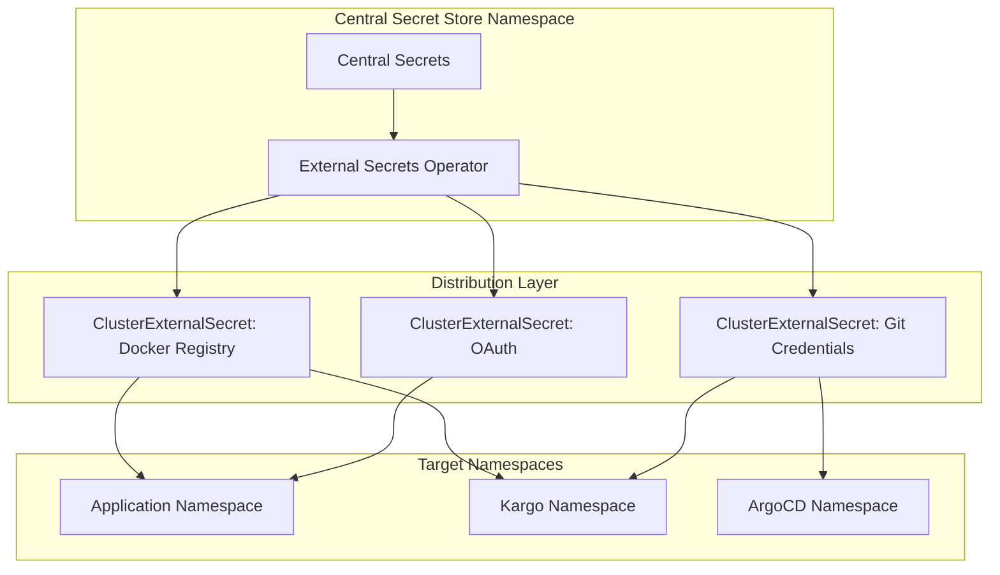

# Design Document: Central Secret Store

## Overview

The Central Secret Store system provides centralized, automated secret management and distribution across the Kubernetes platform using External Secrets Operator (ESO). The system maintains a single source of truth for all platform credentials while automatically distributing appropriately formatted secrets to namespaces based on their requirements.

## Architecture

The system follows a hub-and-spoke architecture where:

- **Central Hub**: A dedicated `central-secret-store` namespace contains master secrets
- **Distribution Layer**: External Secrets Operator with ClusterExternalSecret resources
- **Target Spokes**: Application namespaces receive formatted secrets based on labels
- **Access Control**: RBAC ensures secure access to central credentials



## Components and Interfaces

### ClusterSecretStore

The `ClusterSecretStore` provides the connection between ESO and the central secret storage:

```yaml
apiVersion: external-secrets.io/v1beta1
kind: ClusterSecretStore
metadata:
  name: central-secret-store
spec:
  provider:
    kubernetes:
      server:
        caProvider:
          type: ConfigMap
          name: kube-root-ca.crt
          key: ca.crt
          namespace: kube-system
      auth:
        serviceAccount:
          name: external-secrets
          namespace: external-secrets-system
      remoteNamespace: central-secret-store
```

### ClusterExternalSecret Resources

Each credential type has its own ClusterExternalSecret that defines:
- **Namespace Selection**: Which namespaces receive the secret
- **Secret Template**: How the secret should be formatted
- **Data Mapping**: Which central secret properties to use

### Namespace Labeling System

Namespaces use labels to indicate which secrets they need:
- `secrets/gh-docker-registry: "true"` - Docker registry credentials
- `secrets/gh-git-credentials: "true"` - Git access credentials  
- `secrets/gh-oauth-credentials: "true"` - OAuth application credentials

### Secret Format Templates

Different applications require different secret formats for the same underlying credentials:

**Docker Registry Format (kubernetes.io/dockerconfigjson)**:
```yaml
template:
  type: kubernetes.io/dockerconfigjson
  data:
    .dockerconfigjson: |
      {
        "auths": {
          "ghcr.io": {
            "username": "{{ .username }}",
            "password": "{{ .token }}",
            "auth": "{{ printf \"%s:%s\" .username .token | b64enc }}"
          }
        }
      }
```

**Kargo Format (Opaque with specific labels)**:
```yaml
template:
  type: Opaque
  metadata:
    labels:
      kargo.akuity.io/cred-type: image
  data:
    username: "{{ .username }}"
    password: "{{ .token }}"
    repoURL: "{{ .repoURL }}"
```

## Data Models

### Central Secret Structure

Master secrets in the central store follow this structure:

```yaml
apiVersion: v1
kind: Secret
metadata:
  name: github-pat
  namespace: central-secret-store
type: Opaque
data:
  username: <base64-encoded-username>
  token: <base64-encoded-token>
```

### Distributed Secret Metadata

All distributed secrets include consistent metadata:

```yaml
metadata:
  labels:
    managed-by: external-secrets
    source: central-secret-store
    secret-type: <credential-type>
    kargo.akuity.io/cred-type: <kargo-type>  # When applicable
    argocd.argoproj.io/secret-type: <argocd-type>  # When applicable
```

## Correctness Properties

*A property is a characteristic or behavior that should hold true across all valid executions of a system-essentially, a formal statement about what the system should do. Properties serve as the bridge between human-readable specifications and machine-verifiable correctness guarantees.*

### Property 1: Secret Propagation Consistency
*For any* central secret update, all dependent namespace secrets should be updated within the refresh interval
**Validates: Requirements 1.2**

### Property 2: Namespace-Based Secret Provisioning
*For any* namespace with appropriate labels, the system should automatically provision all required secrets matching those labels
**Validates: Requirements 2.1, 2.2**

### Property 3: Dynamic Label-Based Distribution
*For any* namespace label change, the system should add or remove secrets to match the new label configuration
**Validates: Requirements 2.3, 2.5**

### Property 4: Multi-Pattern Selector Support
*For any* valid namespace selector pattern (label-based, name-based, expression-based), the system should correctly identify and target matching namespaces
**Validates: Requirements 2.4**

### Property 5: Secret Format and Template Correctness
*For any* secret template configuration, the generated secrets should match the specified Kubernetes secret type and contain all required fields in the correct format
**Validates: Requirements 3.1, 3.2, 3.3, 3.4**

### Property 6: Multi-Format Generation from Single Source
*For any* source credential, the system should be able to generate multiple different secret formats simultaneously without data corruption
**Validates: Requirements 3.2**

### Property 7: Credential Type Support
*For any* supported credential type (Docker registry, Git, OAuth, TLS), the system should successfully authenticate and authorize operations using the distributed credentials
**Validates: Requirements 4.1, 4.2, 4.3, 4.4**

### Property 8: Namespace Access Control Enforcement
*For any* namespace and secret combination, the system should only distribute secrets to namespaces that have appropriate authorization labels or selectors
**Validates: Requirements 5.1, 5.2**

### Property 9: Audit Trail Completeness
*For any* secret operation (create, update, delete, access), the system should generate corresponding audit log entries with sufficient detail for security analysis
**Validates: Requirements 1.4, 5.4**

### Property 10: Security Policy Dynamic Updates
*For any* security policy change, the system should update access controls and secret distribution within the refresh interval without manual intervention
**Validates: Requirements 5.5**

## Error Handling

### Central Store Unavailability
- **Graceful Degradation**: Continue operating with cached secrets when central store is unavailable
- **Retry Logic**: Implement exponential backoff for reconnection attempts
- **Status Reporting**: Provide clear status indicators for central store connectivity

### Secret Validation Failures
- **Pre-Distribution Validation**: Validate secret templates before creating ExternalSecrets
- **Format Verification**: Ensure generated secrets match expected Kubernetes secret types
- **Error Propagation**: Surface validation errors through ESO status conditions

### Namespace Targeting Errors
- **Selector Validation**: Validate namespace selectors before applying ClusterExternalSecrets
- **Orphaned Secret Cleanup**: Remove secrets from namespaces that no longer match selectors
- **Conflict Resolution**: Handle cases where multiple ClusterExternalSecrets target the same namespace/secret name

### RBAC and Permission Issues
- **Permission Validation**: Verify ESO service account has required permissions before secret operations
- **Access Denied Handling**: Provide clear error messages for permission failures
- **Least Privilege Enforcement**: Ensure RBAC rules follow principle of least privilege

## Testing Strategy

### Unit Testing Approach
- **Template Validation**: Test secret template rendering with various input combinations
- **Selector Logic**: Test namespace selector matching logic with edge cases
- **Format Conversion**: Test conversion between different secret formats
- **RBAC Validation**: Test permission checking logic

### Property-Based Testing Configuration
- **Minimum 100 iterations** per property test due to randomization
- **ESO Integration**: Use actual External Secrets Operator for realistic testing
- **Namespace Simulation**: Generate random namespace configurations for comprehensive testing
- **Secret Generation**: Test with randomly generated credential data

### Integration Testing Focus
- **ESO Integration**: Verify ClusterExternalSecret resources work correctly with ESO
- **Kubernetes API**: Test secret creation and updates through Kubernetes API
- **Cross-Namespace Distribution**: Verify secrets are correctly distributed across namespaces
- **Label-Based Targeting**: Test namespace selector functionality

### Acceptance Testing Scope
- **End-to-End Workflows**: Test complete secret distribution workflows
- **Application Integration**: Verify applications can successfully use distributed secrets
- **Security Validation**: Confirm access controls work as expected
- **Operational Scenarios**: Test backup/restore, upgrades, and failure scenarios

**Property Test Tags**: Each property test must reference its design document property using the format:
**Feature: central-secret-store, Property {number}: {property_text}**