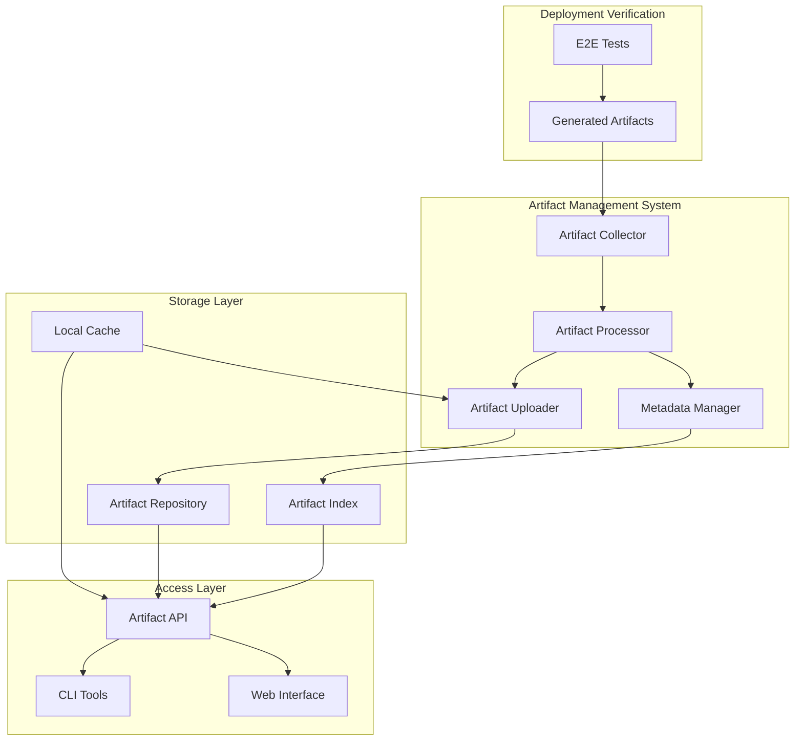

# E2E Test Artifact Management Design Document

## Overview

The E2E Test Artifact Management system provides automated capture, storage, and access to test artifacts generated during deployment verification processes. The system is designed to preserve valuable testing outputs (reports, screenshots, traces) beyond the lifecycle of ephemeral verification processes, making them accessible for debugging, quality assurance, and compliance purposes.

The system follows a plugin-based architecture that integrates seamlessly with existing deployment workflows without disrupting current processes. It supports multiple storage backends and provides a unified interface for artifact management across different deployment environments and testing frameworks.

## Architecture

### High-Level Architecture



### Component Architecture

The system consists of several key components:

1. **Artifact Collector**: Monitors test execution and captures generated artifacts
2. **Artifact Processor**: Handles compression, validation, and organization of artifacts
3. **Metadata Manager**: Extracts and manages contextual information about test execution
4. **Artifact Uploader**: Manages reliable upload to storage repositories with retry logic
5. **Storage Abstraction**: Provides unified interface to multiple storage backends
6. **Access Interface**: Enables browsing, searching, and downloading of stored artifacts

## Components and Interfaces

### Artifact Collector

- **File System Monitor**: Watches for artifact generation during test execution
- **Process Integration**: Hooks into test framework completion events
- **Artifact Detection**: Identifies different types of artifacts (reports, screenshots, traces)
- **Temporary Storage**: Manages local staging area for collected artifacts

### Artifact Processor

- **Compression Engine**: Reduces artifact size for efficient storage and transfer
- **Validation Service**: Ensures artifact integrity and format compliance
- **Organization Logic**: Structures artifacts according to deployment context
- **Batch Processing**: Handles multiple artifacts efficiently

### Storage Layer

- **Repository Interface**: Abstract interface for different storage backends
- **GitHub Storage**: Implementation for GitHub releases and repositories
- **S3 Storage**: Implementation for AWS S3 and compatible object storage
- **Local Storage**: Implementation for local file system storage
- **Hybrid Storage**: Combines multiple backends for redundancy and performance

### Access Layer

- **REST API**: Programmatic access to artifacts and metadata
- **Web Dashboard**: Browser-based interface for artifact browsing
- **CLI Tools**: Command-line utilities for artifact management
- **Integration Hooks**: Webhooks and callbacks for external system integration

## Data Models

### Artifact Metadata

```typescript
interface ArtifactMetadata {
  id: string;
  deploymentId: string;
  applicationVersion: string;
  timestamp: Date;
  testExecutionId: string;
  artifacts: ArtifactInfo[];
  context: ExecutionContext;
  status: 'pending' | 'uploaded' | 'failed';
  retryCount: number;
  lastError?: string;
}

interface ArtifactInfo {
  name: string;
  type: 'report' | 'screenshot' | 'trace' | 'log' | 'other';
  size: number;
  compressedSize: number;
  checksum: string;
  path: string;
  url?: string;
  mimeType: string;
}

interface ExecutionContext {
  environment: string;
  testFramework: string;
  testSuite: string;
  duration: number;
  testResults: TestSummary;
  deploymentStage: string;
  triggeredBy: string;
}

interface TestSummary {
  total: number;
  passed: number;
  failed: number;
  skipped: number;
  errors: string[];
}
```

### Storage Configuration

```typescript
interface StorageConfig {
  primary: StorageBackend;
  fallback?: StorageBackend;
  retention: RetentionPolicy;
  compression: CompressionSettings;
  upload: UploadSettings;
}

interface StorageBackend {
  type: 'github' | 's3' | 'local' | 'custom';
  config: Record<string, any>;
  credentials: CredentialConfig;
}

interface RetentionPolicy {
  maxAge: number; // days
  maxSize: number; // bytes
  maxCount: number;
  cleanupStrategy: 'oldest-first' | 'largest-first' | 'failed-first';
}

interface UploadSettings {
  maxRetries: number;
  retryDelay: number; // milliseconds
  backoffMultiplier: number;
  timeout: number; // milliseconds
  chunkSize: number; // bytes for large files
}
```

## Correctness Properties

*A property is a characteristic or behavior that should hold true across all valid executions of a system-essentially, a formal statement about what the system should do. Properties serve as the bridge between human-readable specifications and machine-verifiable correctness guarantees.*

**Property Reflection:**
After reviewing all properties from the prework analysis, I've identified several areas for consolidation:
- Properties 1.1-1.5 (artifact capture) can be combined into comprehensive capture behavior
- Properties 2.1-2.5 (upload behavior) can be streamlined into upload reliability and organization
- Properties 3.2, 3.4, 3.5 (artifact access) can be combined into artifact accessibility
- Properties 4.1-4.5 (storage management) can be consolidated into storage efficiency and reliability
- Properties 5.1-5.5 (metadata management) can be combined into metadata completeness
- Properties 6.1-6.5 (integration) can be streamlined into non-interference guarantees

**Property 1: Artifact capture completeness**
*For any* test execution that generates artifacts, the system should capture all artifact types (reports, screenshots, traces) and preserve them with unique identifiers beyond the process lifecycle
**Validates: Requirements 1.1, 1.2, 1.3, 1.4**

**Property 2: Upload reliability and organization**
*For any* completed deployment verification, artifacts should be uploaded to the repository with proper organization by deployment identifier and timestamp, including retry logic for failures
**Validates: Requirements 2.1, 2.2, 2.3, 2.4, 2.5**

**Property 3: Artifact accessibility and format compliance**
*For any* stored artifact, it should be downloadable in standard formats with proper naming conventions and timestamp labeling
**Validates: Requirements 3.2, 3.4, 3.5**

**Property 4: Storage efficiency and management**
*For any* artifact storage operation, the system should compress artifacts, implement cleanup policies when limits are reached, and handle concurrent operations without conflicts
**Validates: Requirements 4.1, 4.2, 4.3, 4.5**

**Property 5: Metadata completeness and error handling**
*For any* artifact storage operation, the system should include complete metadata about version, deployment context, and execution details, with appropriate defaults and error handling
**Validates: Requirements 5.1, 5.2, 5.3, 5.4, 5.5**

**Property 6: Non-interference with existing workflows**
*For any* integration with deployment verification or CI/CD processes, the system should not modify existing logic or cause failures when artifact operations fail
**Validates: Requirements 6.1, 6.2, 6.3, 6.4**

**Property 7: Error isolation and graceful degradation**
*For any* system failure or unavailability, existing deployment workflows should continue to function normally without interruption
**Validates: Requirements 1.5, 4.4, 6.3, 6.4**

## Error Handling

### Error Categories

1. **Collection Errors**: File system access issues, permission problems, artifact corruption
2. **Processing Errors**: Compression failures, validation errors, metadata extraction issues
3. **Upload Errors**: Network connectivity issues, authentication failures, storage quota exceeded
4. **Storage Errors**: Repository unavailability, API rate limits, storage backend failures
5. **Access Errors**: Authentication issues, authorization failures, artifact not found

### Error Handling Strategies

- **Graceful Degradation**: Continue deployment verification even when artifact management fails
- **Retry Logic**: Exponential backoff for transient failures with configurable retry limits
- **Fallback Storage**: Automatic failover to secondary storage backends when primary fails
- **Error Isolation**: Prevent artifact management failures from affecting core deployment processes
- **Comprehensive Logging**: Detailed error tracking with correlation IDs for debugging

### Recovery Mechanisms

- **Automatic Retry**: Self-healing for transient network and storage issues
- **Manual Recovery**: Tools for reprocessing failed artifact uploads
- **Partial Success**: Handle scenarios where some artifacts succeed and others fail
- **State Reconciliation**: Periodic validation and correction of artifact metadata
- **Cleanup Procedures**: Automated cleanup of incomplete or corrupted artifacts

## Testing Strategy

### Dual Testing Approach

The system employs both unit testing and property-based testing to ensure comprehensive coverage:

- **Unit tests** verify specific component behaviors, error conditions, and integration points
- **Property tests** verify universal behaviors that should hold across all valid inputs
- Together they provide comprehensive coverage: unit tests catch concrete bugs, property tests verify general correctness

### Unit Testing

Unit tests focus on:
- Individual component functionality (collector, processor, uploader)
- Error handling for known failure scenarios
- Configuration validation and parsing
- Storage backend implementations
- API endpoint behaviors

### Property-Based Testing

Property-based testing uses **fast-check** for JavaScript/TypeScript to verify system properties:
- Each property-based test runs a minimum of 100 iterations
- Tests generate random deployment scenarios and artifact sets
- Properties are tagged with comments referencing design document properties
- Tag format: **Feature: e2e-artifact-management, Property {number}: {property_text}**

**Property-Based Test Requirements:**
- Use fast-check library for property-based testing in TypeScript
- Configure each test to run minimum 100 iterations
- Tag each test with exact format: '**Feature: e2e-artifact-management, Property {number}: {property_text}**'
- Each correctness property must be implemented by a single property-based test
- Focus on universal behaviors across different artifact types and deployment scenarios

### Integration Testing

Integration tests verify:
- End-to-end artifact flow from collection to storage
- Storage backend integration and failover behavior
- API functionality and authentication
- Web interface functionality
- CLI tool operations

### Performance Testing

Performance tests validate:
- Large artifact upload efficiency
- Concurrent upload handling
- Storage cleanup performance
- API response times under load
- Memory usage during artifact processing

### Test Environment Management

- **Local Development**: Tests run against mock storage backends
- **CI/CD Pipeline**: Automated test execution with real storage integration
- **Test Data**: Isolated test artifacts and cleanup procedures
- **Test Reporting**: Comprehensive test reports with performance metrics