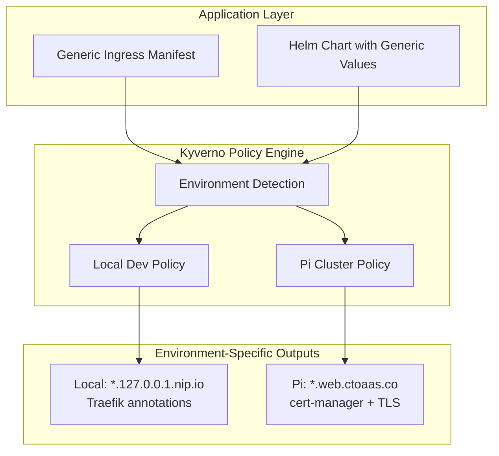

# Environment-Aware Ingress Management System Design

## Overview

The Environment-Aware Ingress Management System uses Kyverno policies to automatically transform generic ingress resources into environment-specific configurations. This eliminates hardcoded domain names and environment-specific annotations from application manifests, enabling the same ingress definitions to work across local development and pi cluster environments.

The system works by detecting ingress resources with a special annotation (`ingress.ctoaas.co/managed: "true"`) and applying environment-specific transformations through Kyverno mutating policies. Each environment has its own policy that applies appropriate domain suffixes, TLS configuration, and network annotations.

## Architecture



The system follows a policy-per-environment pattern where each environment has its own Kyverno ClusterPolicy that applies the appropriate transformations.

## Components and Interfaces

### 1. Generic Ingress Annotation System

Applications mark ingress resources for management using a single annotation:

```yaml
metadata:
  name: backstage  # Used as service name for domain generation
  annotations:
    ingress.ctoaas.co/managed: "true"
```

The system derives the service name from the ingress metadata name and extracts any subdomain preferences from existing host rules in the ingress spec.

### 2. Environment Detection

Kyverno policies use cluster-specific labels or ConfigMaps to determine the current environment:

```yaml
context:
  - name: environment
    configMap:
      name: cluster-environment
      namespace: kyverno
```

### 3. Base Ingress Management Policy

A single Kyverno ClusterPolicy that reads environment configuration from a ConfigMap and applies appropriate transformations based on the environment context.

### 4. Environment-Specific Overlays

Each environment uses kustomize overlays to customize the environment configuration:

**Local Development Overlay:**
- Domain pattern: `{service-name}.127.0.0.1.nip.io`
- Traefik annotations for local routing
- TLS disabled for simplified development

**Pi Cluster Overlay:**
- Domain pattern: `{service-name}.web.ctoaas.co`
- cert-manager annotations for Let's Encrypt
- Cloudflare DNS-01 challenge configuration
- Automatic TLS secret generation

### 5. Policy Configuration Management

The system uses a single policy with environment-specific configuration through kustomize overlays:
```
kustomize/ingress-management/
├── base/
│   ├── ingress-management-policy.yaml
│   ├── environment-config.yaml
│   └── kustomization.yaml
└── overlays/
    ├── local/
    │   ├── environment-config-patch.yaml
    │   └── kustomization.yaml
    └── pi/
        ├── environment-config-patch.yaml
        └── kustomization.yaml
```

## Data Models

### Environment Configuration

**Base Configuration:**
```yaml
apiVersion: v1
kind: ConfigMap
metadata:
  name: ingress-environment-config
  namespace: kyverno
data:
  environment: "local"
  domain-suffix: "127.0.0.1.nip.io"
  tls-enabled: "false"
  ingress-class: "traefik"
  annotations: |
    traefik.ingress.kubernetes.io/router.entrypoints: websecure
    traefik.ingress.kubernetes.io/router.tls: "true"
```

**Pi Cluster Overlay Patch:**
```yaml
apiVersion: v1
kind: ConfigMap
metadata:
  name: ingress-environment-config
  namespace: kyverno
data:
  environment: "pi"
  domain-suffix: "web.ctoaas.co"
  tls-enabled: "true"
  cert-issuer: "letsencrypt-prod"
  ingress-class: "traefik"
  annotations: |
    cert-manager.io/cluster-issuer: letsencrypt-prod
```

### Generic Ingress Template

```yaml
apiVersion: networking.k8s.io/v1
kind: Ingress
metadata:
  name: backstage  # Used for domain generation
  annotations:
    ingress.ctoaas.co/managed: "true"
spec:
  rules:
  - host: "placeholder.local"  # Will be replaced with environment-specific domain
    http:
      paths:
      - path: /
        pathType: Prefix
        backend:
          service:
            name: backstage
            port:
              name: http
```

For custom subdomains, developers can specify them in the placeholder host:
```yaml
spec:
  rules:
  - host: "api.placeholder.local"  # Results in api.backstage.web.ctoaas.co
```

### Transformed Ingress (Pi Cluster)

```yaml
apiVersion: networking.k8s.io/v1
kind: Ingress
metadata:
  name: backstage
  annotations:
    ingress.ctoaas.co/managed: "true"
    cert-manager.io/cluster-issuer: letsencrypt-prod
    managed-by: kyverno-ingress-policy
spec:
  ingressClassName: traefik
  tls:
  - hosts:
    - backstage.web.ctoaas.co
    secretName: backstage-web-ctoaas-tls
  rules:
  - host: backstage.web.ctoaas.co  # Generated from metadata.name + environment domain suffix
    http:
      paths:
      - path: /
        pathType: Prefix
        backend:
          service:
            name: backstage
            port:
              name: http
```

## Correctness Properties

*A property is a characteristic or behavior that should hold true across all valid executions of a system-essentially, a formal statement about what the system should do. Properties serve as the bridge between human-readable specifications and machine-verifiable correctness guarantees.*
Property 1: Domain generation consistency
*For any* valid service identifier and environment context, generating a domain name should produce a predictable pattern that follows the environment's domain suffix rules
**Validates: Requirements 1.1, 1.3**

Property 2: Environment-specific domain transformation
*For any* ingress configuration, deploying to different environments should produce different domain suffixes while preserving the service identifier
**Validates: Requirements 1.2**

Property 3: Custom subdomain preservation
*For any* ingress with a custom subdomain annotation, the generated domain should preserve the custom subdomain while applying the environment-specific suffix
**Validates: Requirements 1.4**

Property 4: Service identifier validation
*For any* service identifier input, the system should accept valid identifiers according to the naming grammar and reject invalid ones
**Validates: Requirements 1.5**

Property 5: Environment-specific annotation application
*For any* ingress deployed to a specific environment, the system should apply the correct set of annotations for that environment (Traefik for local, cert-manager for pi)
**Validates: Requirements 2.1, 2.2, 2.3**

Property 6: TLS configuration by environment
*For any* ingress deployed to an environment with TLS enabled, the system should automatically configure certificate management appropriate for that environment
**Validates: Requirements 2.4, 6.1, 6.3**

Property 7: Annotation preservation during transformation
*For any* ingress with existing custom annotations, the transformation should preserve all original annotations while adding environment-specific ones
**Validates: Requirements 2.5, 4.5**

Property 8: Management annotation trigger
*For any* ingress resource, the system should process it for transformation if and only if it contains the management annotation
**Validates: Requirements 3.1, 3.2**

Property 9: Service name resolution
*For any* ingress resource, if a service name is specified in annotations it should be used for domain generation, otherwise the system should derive it from metadata
**Validates: Requirements 3.3, 3.4**

Property 10: Consistent transformation across creation methods
*For any* ingress resource, whether created through Helm or direct manifests, the transformation rules should be applied consistently
**Validates: Requirements 4.1, 4.2**

Property 11: Update and recreate consistency
*For any* ingress resource that is updated or recreated, the environment-specific configurations should be reapplied consistently
**Validates: Requirements 4.3, 4.4**

Property 12: Environment policy separation
*For any* environment context, the system should maintain separate policy configurations that don't interfere with other environments
**Validates: Requirements 5.3**

Property 13: Certificate secret name generation
*For any* ingress with TLS enabled, the generated certificate secret names should follow predictable patterns based on the domain names
**Validates: Requirements 6.2, 6.4**

Property 14: Development environment TLS flexibility
*For any* ingress deployed to development environment, TLS configuration should be optional and when disabled, no TLS-related configuration should be applied
**Validates: Requirements 6.5**

## Error Handling

### Invalid Annotation Values
- Log detailed error messages for invalid service names or subdomain patterns
- Skip processing ingress resources with invalid annotations
- Maintain original ingress configuration when errors occur

### Missing Environment Configuration
- Fail gracefully when environment ConfigMap is missing
- Provide clear error messages indicating required configuration
- Default to safe fallback behavior (no transformation)

### Policy Conflicts
- Detect and report conflicting Kyverno policies
- Ensure ingress management policies have appropriate priority
- Validate policy syntax during deployment

### Certificate Management Errors
- Handle cert-manager integration failures gracefully
- Provide clear error messages for TLS configuration issues
- Fall back to manual certificate management when automated provisioning fails

## Testing Strategy

### Dual Testing Approach

The system will use both unit testing and property-based testing to ensure comprehensive coverage:

**Unit Tests** will verify:
- Specific examples of domain generation patterns
- Integration between Kyverno policies and Kubernetes API
- Error handling for common failure scenarios
- Policy deployment and configuration validation

**Property-Based Tests** will verify:
- Universal properties that should hold across all inputs using **fast-check** library
- Each property-based test will run a minimum of 100 iterations
- Domain generation consistency across various service identifiers and environments
- Annotation preservation and transformation correctness
- Environment-specific behavior across different contexts

### Property-Based Testing Configuration

The system will use **fast-check** as the property-based testing library for JavaScript/TypeScript components and **Hypothesis** for any Python-based policy validation tools.

Each property-based test will be tagged with comments explicitly referencing the correctness property from this design document using the format: `**Feature: ingress-management, Property {number}: {property_text}**`

### Integration Testing

- Test complete ingress transformation workflows in isolated Kubernetes environments
- Validate Kyverno policy behavior with real ingress resources
- Verify cert-manager integration in pi cluster environment
- Test Helm chart integration with transformed ingress resources

### End-to-End Testing

- Deploy sample applications with generic ingress configurations
- Verify domain resolution and TLS certificate provisioning
- Test ingress accessibility from external clients
- Validate environment-specific routing and load balancing

## Implementation Considerations

### Kyverno Policy Performance
- Use efficient JMESPath expressions for resource matching
- Minimize API calls in policy context sections
- Implement proper resource filtering to avoid unnecessary processing

### Environment Configuration Management
- Store environment configuration in version-controlled ConfigMaps
- Use GitOps workflows for policy deployment and updates
- Implement validation webhooks for environment configuration changes

### Migration Strategy
- Provide tooling to migrate existing hardcoded ingress resources
- Support gradual rollout with annotation-based opt-in
- Maintain backward compatibility during transition period

### Monitoring and Observability
- Implement metrics for policy execution and transformation success rates
- Log transformation events for debugging and audit purposes
- Provide dashboards for monitoring ingress management system health