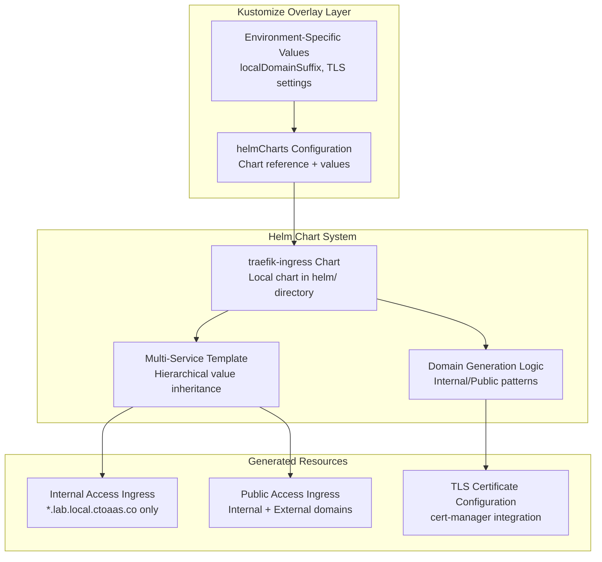

# Helm-Based Ingress Management System Design

## Overview

The Helm-Based Ingress Management System uses a local traefik-ingress Helm chart integrated with kustomize's helmCharts feature to generate environment-specific ingress resources. The system eliminates hardcoded domain names and repetitive Traefik annotations by providing a reusable Helm template that accepts environment-specific values through kustomize overlays.

The system uses a multi-service chart that can generate multiple ingress resources with hierarchical value inheritance. Common configuration (domain suffixes, TLS settings, annotations) is defined at the root level, while individual ingress configurations can override specific values as needed. Single-service use cases are handled as a single entry in the ingresses array.

## Architecture



The system uses a single approach:

**Helm Chart Integration**: Uses kustomize's helmCharts feature with a local traefik-ingress chart that provides templating capabilities, hierarchical value inheritance, and environment-specific configuration through kustomize overlays.

## Components and Interfaces

### 1. Helm Chart Template System

The traefik-ingress Helm chart provides a reusable template for generating Traefik ingress resources:

**Single Service Configuration:**
```yaml
helmCharts:
- name: traefik-ingress
  releaseName: argocd
  valuesInline:
    # Common configuration
    domains:
      localDomainSuffix: lab.local.ctoaas.co
      publicDomainSuffix: lab.ctoaas.co
    tls:
      enabled: true
      issuer: letsencrypt-prod
    
    # Single ingress in array
    ingresses:
    - service:
        name: argocd-server
        namespace: argocd
      ingress:
        accessPattern: internal
```

**Multi-Service Configuration:**
```yaml
helmCharts:
- name: traefik-ingress
  releaseName: platform-ingresses
  valuesInline:
    # Common configuration applied to all ingresses
    domains:
      localDomainSuffix: lab.local.ctoaas.co
      publicDomainSuffix: lab.ctoaas.co
    tls:
      enabled: true
      issuer: letsencrypt-prod
    
    # Array of ingress configurations
    ingresses:
    - service:
        name: kargo-api
        namespace: kargo
      ingress:
        accessPattern: internal
    - service:
        name: rabbitmq
        namespace: eda-mesh
      ingress:
        accessPattern: public
    - service:
        name: argo-rollouts-dashboard
        namespace: argo-rollouts
      ingress:
        accessPattern: internal
```

**Multi-Path Configuration:**
```yaml
helmCharts:
- name: traefik-ingress
  releaseName: kargo-ingress
  valuesInline:
    domains:
      localDomainSuffix: lab.local.ctoaas.co
      publicDomainSuffix: lab.ctoaas.co
    tls:
      enabled: true
      issuer: letsencrypt-prod
    
    # Single ingress with multiple paths
    ingresses:
    - service:
        name: kargo-api  # Default service for root path
        namespace: kargo
      ingress:
        accessPattern: public
        paths:
        - path: /
          pathType: Prefix
          service:
            name: kargo-api
            port:
              number: 80
        - path: /webhooks
          pathType: Prefix
          service:
            name: kargo-external-webhooks-server
            port:
              number: 80
```

### 2. Environment Integration

Kustomize overlays provide environment-specific values directly to the Helm chart:

```yaml
# Lab environment overlay
helmCharts:
- name: traefik-ingress
  valuesInline:
    domains:
      localDomainSuffix: lab.local.ctoaas.co
      publicDomainSuffix: lab.ctoaas.co
    tls:
      enabled: true
      issuer: letsencrypt-prod

# Local development overlay  
helmCharts:
- name: traefik-ingress
  valuesInline:
    domains:
      localDomainSuffix: 127.0.0.1.nip.io
    tls:
      enabled: false
```

### 3. Access Pattern Control

The chart supports two access patterns:

**Internal Access (`accessPattern: internal`):**
- Creates host rules only for internal domains (e.g., `service.lab.local.ctoaas.co`)
- TLS certificate includes only internal domain
- Suitable for most platform services

**Public Access (`accessPattern: public`):**
- Creates host rules for both internal and external domains
- TLS certificate includes both domains
- Suitable for user-facing services like ArgoCD UI

## Data Models

### Helm Chart Values Structure

**Root Level Configuration:**
```yaml
# Common configuration inherited by all ingresses
domains:
  localDomainSuffix: lab.local.ctoaas.co
  publicDomainSuffix: lab.ctoaas.co
tls:
  enabled: true
  issuer: letsencrypt-prod
traefik:
  router:
    entrypoints: websecure
    tls: true

# Array of ingress configurations
ingresses:
- service:
    name: service-name
    namespace: service-namespace
    port:
      name: http
  ingress:
    accessPattern: internal  # or "public"
    name: custom-ingress-name  # optional override
    # Single path (backward compatible)
    path: /
    pathType: Prefix
    # OR multiple paths (new feature)
    paths:
    - path: /
      pathType: Prefix
      service:
        name: primary-service
        port:
          number: 80
    - path: /api
      pathType: Prefix
      service:
        name: api-service
        port:
          name: http
  domains:
    name: custom-domain-prefix  # optional override
  # Individual ingress can override any root-level values
```

### Generated Internal Access Ingress (Lab Cluster)

```yaml
apiVersion: networking.k8s.io/v1
kind: Ingress
metadata:
  name: service-name-ingress
  namespace: service-namespace
  annotations:
    traefik.ingress.kubernetes.io/router.entrypoints: websecure
    traefik.ingress.kubernetes.io/router.tls: "true"
    cert-manager.io/cluster-issuer: letsencrypt-prod
spec:
  ingressClassName: traefik
  tls:
  - hosts:
    - service-name.lab.local.ctoaas.co
    secretName: service-name-ingress-lab-local-ctoaas-tls
  rules:
  - host: service-name.lab.local.ctoaas.co
    http:
      paths:
      - path: /
        pathType: Prefix
        backend:
          service:
            name: service-name
            port:
              name: http
```

### Generated Public Access Ingress (Lab Cluster)

```yaml
apiVersion: networking.k8s.io/v1
kind: Ingress
metadata:
  name: service-name-ingress
  namespace: service-namespace
  annotations:
    traefik.ingress.kubernetes.io/router.entrypoints: websecure
    traefik.ingress.kubernetes.io/router.tls: "true"
    cert-manager.io/cluster-issuer: letsencrypt-prod
spec:
  ingressClassName: traefik
  tls:
  - hosts:
    - service-name.lab.local.ctoaas.co
    - service-name.lab.ctoaas.co
    secretName: service-name-ingress-lab-ctoaas-tls
  rules:
  - host: service-name.lab.local.ctoaas.co  # Internal access
    http:
      paths:
      - path: /
        pathType: Prefix
        backend:
          service:
            name: service-name
            port:
              name: http
  - host: service-name.lab.ctoaas.co  # External access
    http:
      paths:
      - path: /
        pathType: Prefix
        backend:
          service:
            name: service-name
            port:
              name: http
```

## Correctness Properties

*A property is a characteristic or behavior that should hold true across all valid executions of a system-essentially, a formal statement about what the system should do. Properties serve as the bridge between human-readable specifications and machine-verifiable correctness guarantees.*

Property 1: Domain generation consistency
*For any* valid service identifier and environment context, the system should generate predictable domain names that follow the environment's domain suffix patterns and preserve service identifiers
**Validates: Requirements 1.1, 1.3, 3.3**

Property 2: Environment-specific transformation
*For any* ingress configuration, deploying to different environments should produce different domain suffixes, annotations, and network configurations appropriate for each environment
**Validates: Requirements 1.2, 2.1, 2.2, 2.3, 2.4, 2.9**

Property 3: Custom subdomain preservation
*For any* ingress with custom subdomain specifications, the system should preserve the custom subdomain while applying environment-specific domain suffixes
**Validates: Requirements 1.4, 3.4**

Property 4: Service identifier validation
*For any* service identifier input, the system should accept valid identifiers according to naming conventions and preserve special characters like hyphens in generated domains
**Validates: Requirements 1.5, 2.10**

Property 5: Annotation management
*For any* ingress transformation, the system should preserve existing custom annotations while adding environment-specific annotations without conflicts
**Validates: Requirements 2.5, 4.5**

Property 6: Management annotation trigger
*For any* ingress resource, the system should process it for transformation if and only if it contains the management annotation, leaving unmanaged resources unchanged
**Validates: Requirements 3.1, 3.2**

Property 7: Managed ingress domain restriction
*For any* ingress resource with the management label, the system should create host rules only for internal domain patterns and exclude external domains
**Validates: Requirements 7.1, 7.2**

Property 8: Unlabeled ingress preservation
*For any* ingress resource without management labels, the system should leave it completely unchanged
**Validates: Requirements 7.3**

Property 9: Creation method independence
*For any* ingress resource, the transformation rules should be applied consistently regardless of whether it was created through Helm charts or direct Kubernetes manifests
**Validates: Requirements 4.1, 4.2**

Property 10: Update and lifecycle consistency
*For any* managed ingress resource that is updated, deleted, or recreated, the system should reapply environment-specific configurations consistently
**Validates: Requirements 4.3, 4.4**

Property 11: Environment policy separation
*For any* set of environments, the system should maintain separate policy configurations that don't interfere with each other and are stored in version-controllable YAML format
**Validates: Requirements 5.3, 5.5**

Property 12: TLS configuration management
*For any* environment with TLS enabled, the system should automatically configure certificate management with appropriate issuer annotations and generate predictable certificate secret names
**Validates: Requirements 8.1, 8.2, 8.3, 8.4**

Property 13: Development environment TLS flexibility
*For any* development environment, the system should support optional TLS disabling for simplified local testing
**Validates: Requirements 8.5**

Property 7: Managed ingress domain restriction
*For any* ingress resource with the management label, the system should create host rules only for internal domain patterns and exclude external domains
**Validates: Requirements 7.1, 7.2**

Property 8: Unlabeled ingress preservation
*For any* ingress resource without management labels, the system should leave it completely unchanged
**Validates: Requirements 7.3**

Property 14: Kustomize build validation
*For any* kustomize overlay containing ingress resources, the build output should contain correctly transformed ingress configurations that match the environment's expected domain patterns and TLS settings
**Validates: Requirements 9.1, 9.2**

Property 15: Environment-specific ingress transformation testing
*For any* environment overlay, ingress resources with management labels should be transformed according to that environment's domain configuration while preserving unlabeled ingress resources unchanged
**Validates: Requirements 9.3, 9.6**

Property 16: ArgoCD ingress domain testing
*For any* ArgoCD ingress configuration in lab overlay builds, the output should contain internal (.lab.local.ctoaas.co) domain patterns with appropriate TLS configuration
**Validates: Requirements 9.4**

Property 17: Backstage ingress domain testing
*For any* Backstage ingress configuration in overlay builds, the output should contain internal domain patterns
**Validates: Requirements 9.5**

Property 18: Regression prevention through continuous integration
*For any* pull request or commit, kustomize build tests should execute automatically and prevent deployment of configurations that fail ingress transformation validation
**Validates: Requirements 9.7, 9.8, 9.9**

Property 19: Multiple paths configuration
*For any* ingress configuration with multiple paths specified, the system should generate path rules for each path with appropriate backend service references and path types
**Validates: Requirements 6.1, 6.2, 6.3, 6.4**

Property 20: Multi-path TLS configuration
*For any* ingress with multiple paths and TLS enabled, the system should configure TLS for the host covering all paths without duplicating TLS configuration
**Validates: Requirements 6.5**
## Error Handling

### Invalid Label Values
- Kustomize will fail to build if label selectors don't match any resources
- Clear error messages indicate which ingress resources need management labels
- Build-time validation prevents deployment of invalid configurations

### Missing Environment Configuration
- Kustomize build fails when required ConfigMap values are missing
- Clear error messages indicate which configuration values are required
- No runtime failures since all processing happens at build time

### Configuration Conflicts
- Kustomize replacement conflicts are detected at build time
- Clear error messages show which replacements are conflicting
- No runtime policy conflicts since no admission controllers are involved

### Domain Generation Errors
- Invalid domain patterns cause kustomize build failures
- Replacement errors are visible in build output
- No silent failures since all transformations are explicit

## Testing Strategy

### Dual Testing Approach

The system will use both unit testing and property-based testing to ensure comprehensive coverage:

**Unit Tests** will verify:
- Specific examples of domain generation patterns
- Integration between Kyverno policies and Kubernetes API
- Error handling for common failure scenarios
- Policy deployment and configuration validation

**Property-Based Tests** will verify:
- Universal properties that should hold across all inputs using **fast-check** library
- Each property-based test will run a minimum of 100 iterations
- Domain generation consistency across various service identifiers and environments
- Annotation preservation and transformation correctness
- Environment-specific behavior across different contexts

### Property-Based Testing Configuration

The system will use **fast-check** as the property-based testing library for JavaScript/TypeScript components and **Hypothesis** for any Python-based validation tools.

Each property-based test will be tagged with comments explicitly referencing the correctness property from this design document using the format: `**Feature: ingress-management, Property {number}: {property_text}**`

### Integration Testing

- Test complete ingress transformation workflows using kustomize build
- Validate component behavior with real ingress resources
- Verify cert-manager integration in lab cluster environment
- Test Helm chart integration with transformed ingress resources

### End-to-End Testing

- Deploy sample applications with generic ingress configurations
- Verify domain resolution and TLS certificate provisioning
- Test ingress accessibility from external clients
- Validate environment-specific routing and load balancing

## Implementation Considerations

### Kustomize Component Performance
- Use efficient replacement patterns for resource transformation
- Minimize ConfigMap lookups through proper field path specifications
- Implement proper resource filtering to avoid unnecessary processing

### Environment Configuration Management
- Store environment configuration in version-controlled ConfigMaps
- Use GitOps workflows for component deployment and updates
- Implement validation for environment configuration changes

### Migration Strategy
- Provide tooling to migrate existing hardcoded ingress resources
- Support gradual rollout with label-based opt-in
- Maintain backward compatibility during transition period

### Monitoring and Observability
- Monitor kustomize build success rates for ingress transformations
- Log transformation events for debugging and audit purposes
- Provide dashboards for monitoring ingress management system health
### Transformed Managed Ingress (Lab Cluster)

```yaml
apiVersion: networking.k8s.io/v1
kind: Ingress
metadata:
  name: backstage
  labels:
    ingress.ctoaas.co/managed: "true"
  annotations:
    cert-manager.io/cluster-issuer: letsencrypt-prod
    managed-by: kustomize-ingress-component
spec:
  ingressClassName: traefik
  tls:
  - hosts:
    - backstage.lab.local.ctoaas.co
    secretName: backstage-lab-local-ctoaas-tls
  rules:
  - host: backstage.lab.local.ctoaas.co  # Internal access
    http:
      paths:
      - path: /
        pathType: Prefix
        backend:
          service:
            name: backstage
            port:
              name: http
```

For custom subdomains, developers can specify them in the placeholder host:
```yaml
spec:
  rules:
  - host: "api.backstage.placeholder.local"  # Results in api.backstage.lab.local.ctoaas.co
```