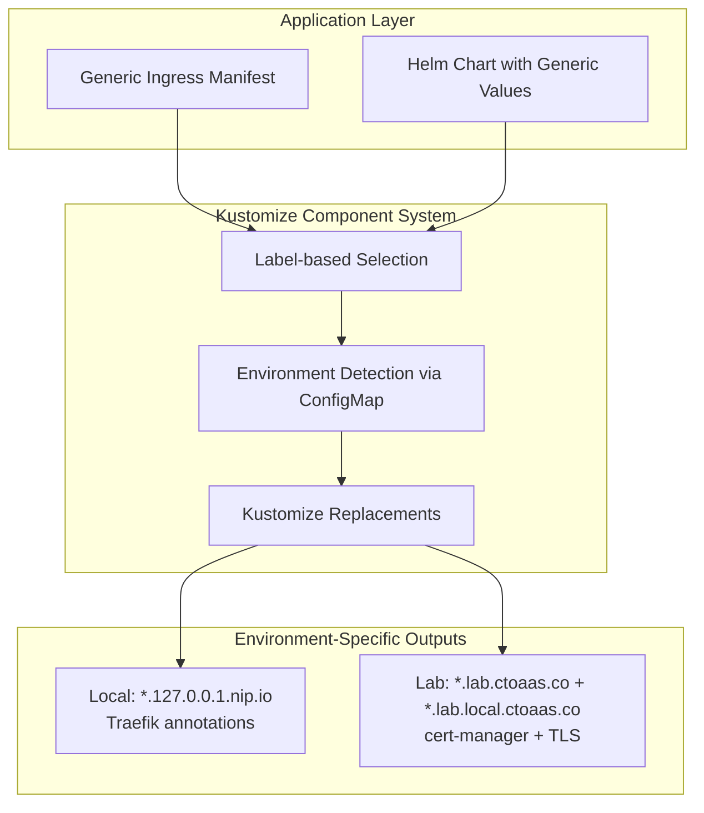

# Environment-Aware Ingress Management System Design

## Overview

The Environment-Aware Ingress Management System uses a kustomize component to automatically transform generic ingress resources into environment-specific configurations. This eliminates hardcoded domain names and environment-specific annotations from application manifests, enabling the same ingress definitions to work across local development and lab cluster environments.

The system works by detecting ingress resources with a special label (`ingress.ctoaas.co/managed: "true"`) and applying environment-specific transformations through kustomize's built-in replacement mechanism. Each environment overlay includes the component and provides environment-specific configuration through a ConfigMap.

## Architecture



The system follows a component-per-environment pattern where each environment overlay includes the ingress management component and provides environment-specific configuration through a ConfigMap.

## Components and Interfaces

### 1. Generic Ingress Label System

Applications mark ingress resources for management using a label:

```yaml
metadata:
  name: backstage  # Used as service name for domain generation
  labels:
    ingress.ctoaas.co/managed: "true"
    ingress.ctoaas.co/multi-domain: "true"  # Optional: for multi-domain environments
```

The system derives the service name from the ingress metadata name and uses kustomize replacements to transform placeholder domains into environment-specific domains.

### 2. Environment Detection

Kustomize components use environment-specific ConfigMaps to determine the current environment configuration:

```yaml
configMapGenerator:
  - name: ingress-environment-config
    literals:
      - primaryDomainSuffix=lab.ctoaas.co
      - secondaryDomainSuffix=lab.local.ctoaas.co
      - ingressClass=traefik
      - tlsEnabled=letsencrypt-prod
```

### 3. Kustomize Component System

A single kustomize component that uses built-in replacement functionality to transform ingress resources based on environment configuration from ConfigMaps.

### 4. Environment-Specific Overlays

Each environment uses kustomize overlays to include the component and provide environment-specific configuration:

**Local Development Overlay:**
- Domain pattern: `{service-name}.127.0.0.1.nip.io`
- Traefik annotations for local routing
- TLS disabled for simplified development

**Lab Cluster Overlay:**
- Domain patterns: `{service-name}.lab.ctoaas.co` and `{service-name}.lab.local.ctoaas.co`
- cert-manager annotations for Let's Encrypt
- Cloudflare DNS-01 challenge configuration
- Automatic TLS secret generation with multiple domain support

### 5. Component Configuration Management

The system uses a single component with environment-specific configuration through kustomize overlays:
```
kustomize/_common/components/ingress-management/
├── kustomization.yaml          # Component with replacements
└── README.md                   # Documentation
```

## Data Models

### Environment Configuration

**Base Configuration:**
```yaml
configMapGenerator:
  - name: ingress-environment-config
    literals:
      - primaryDomainSuffix=127.0.0.1.nip.io
      - ingressClass=traefik
      - tlsEnabled=""
      - annotations=traefik.ingress.kubernetes.io/router.tls=true
```

**Lab Cluster Overlay Configuration:**
```yaml
configMapGenerator:
  - name: ingress-environment-config
    literals:
      - primaryDomainSuffix=lab.ctoaas.co
      - secondaryDomainSuffix=lab.local.ctoaas.co
      - ingressClass=traefik
      - tlsEnabled=letsencrypt-prod
      - annotations=cert-manager.io/cluster-issuer=letsencrypt-prod
```

### Generic Ingress Template

```yaml
apiVersion: networking.k8s.io/v1
kind: Ingress
metadata:
  name: backstage  # Used for domain generation
  labels:
    ingress.ctoaas.co/managed: "true"
spec:
  rules:
  - host: "backstage"  # Will be suffixed with environment-specific domain
    http:
      paths:
      - path: /
        pathType: Prefix
        backend:
          service:
            name: backstage
            port:
              name: http
```

For custom subdomains, developers can specify them in the placeholder host:
```yaml
spec:
  rules:
  - host: "api.backstage.placeholder.local"  # Results in api.backstage.lab.ctoaas.co
```

### Transformed Ingress (Lab Cluster)

```yaml
apiVersion: networking.k8s.io/v1
kind: Ingress
metadata:
  name: backstage
  labels:
    ingress.ctoaas.co/managed: "true"
  annotations:
    cert-manager.io/cluster-issuer: letsencrypt-prod
    managed-by: kustomize-ingress-component
spec:
  ingressClassName: traefik
  tls:
  - hosts:
    - backstage.lab.ctoaas.co
    - backstage.lab.local.ctoaas.co
    secretName: backstage-lab-ctoaas-tls
  rules:
  - host: backstage.lab.ctoaas.co  # Generated from metadata.name + environment domain suffixes
    http:
      paths:
      - path: /
        pathType: Prefix
        backend:
          service:
            name: backstage
            port:
              name: http
  - host: backstage.lab.local.ctoaas.co  # Second domain pattern for internal access
    http:
      paths:
      - path: /
        pathType: Prefix
        backend:
          service:
            name: backstage
            port:
              name: http
```

## Correctness Properties

*A property is a characteristic or behavior that should hold true across all valid executions of a system-essentially, a formal statement about what the system should do. Properties serve as the bridge between human-readable specifications and machine-verifiable correctness guarantees.*

Property 1: Domain generation consistency
*For any* valid service identifier and environment context, the system should generate predictable domain names that follow the environment's domain suffix patterns and preserve service identifiers
**Validates: Requirements 1.1, 1.3, 3.3**

Property 2: Environment-specific transformation
*For any* ingress configuration, deploying to different environments should produce different domain suffixes, annotations, and network configurations appropriate for each environment
**Validates: Requirements 1.2, 2.1, 2.2, 2.3, 2.4, 2.9**

Property 3: Multiple domain pattern support
*For any* environment configured with multiple domain patterns, the system should create separate host rules for each pattern and include all domains in TLS certificate configuration
**Validates: Requirements 2.6, 2.7, 2.8**

Property 4: Custom subdomain preservation
*For any* ingress with custom subdomain specifications, the system should preserve the custom subdomain while applying environment-specific domain suffixes
**Validates: Requirements 1.4, 3.4**

Property 5: Service identifier validation
*For any* service identifier input, the system should accept valid identifiers according to naming conventions and preserve special characters like hyphens in generated domains
**Validates: Requirements 1.5, 2.10**

Property 6: Annotation management
*For any* ingress transformation, the system should preserve existing custom annotations while adding environment-specific annotations without conflicts
**Validates: Requirements 2.5, 4.5**

Property 7: Management annotation trigger
*For any* ingress resource, the system should process it for transformation if and only if it contains the management annotation, leaving unmanaged resources unchanged
**Validates: Requirements 3.1, 3.2**

Property 8: Creation method independence
*For any* ingress resource, the transformation rules should be applied consistently regardless of whether it was created through Helm charts or direct Kubernetes manifests
**Validates: Requirements 4.1, 4.2**

Property 9: Update and lifecycle consistency
*For any* managed ingress resource that is updated, deleted, or recreated, the system should reapply environment-specific configurations consistently
**Validates: Requirements 4.3, 4.4**

Property 10: Environment policy separation
*For any* set of environments, the system should maintain separate policy configurations that don't interfere with each other and are stored in version-controllable YAML format
**Validates: Requirements 5.3, 5.5**

Property 11: TLS configuration management
*For any* environment with TLS enabled, the system should automatically configure certificate management with appropriate issuer annotations and generate predictable certificate secret names
**Validates: Requirements 6.1, 6.2, 6.3, 6.4**

Property 12: Development environment TLS flexibility
*For any* development environment, the system should support optional TLS disabling for simplified local testing
## Error Handling

### Invalid Label Values
- Kustomize will fail to build if label selectors don't match any resources
- Clear error messages indicate which ingress resources need management labels
- Build-time validation prevents deployment of invalid configurations

### Missing Environment Configuration
- Kustomize build fails when required ConfigMap values are missing
- Clear error messages indicate which configuration values are required
- No runtime failures since all processing happens at build time

### Configuration Conflicts
- Kustomize replacement conflicts are detected at build time
- Clear error messages show which replacements are conflicting
- No runtime policy conflicts since no admission controllers are involved

### Domain Generation Errors
- Invalid domain patterns cause kustomize build failures
- Replacement errors are visible in build output
- No silent failures since all transformations are explicit

## Testing Strategy

### Dual Testing Approach

The system will use both unit testing and property-based testing to ensure comprehensive coverage:

**Unit Tests** will verify:
- Specific examples of domain generation patterns
- Integration between Kyverno policies and Kubernetes API
- Error handling for common failure scenarios
- Policy deployment and configuration validation

**Property-Based Tests** will verify:
- Universal properties that should hold across all inputs using **fast-check** library
- Each property-based test will run a minimum of 100 iterations
- Domain generation consistency across various service identifiers and environments
- Annotation preservation and transformation correctness
- Environment-specific behavior across different contexts

### Property-Based Testing Configuration

The system will use **fast-check** as the property-based testing library for JavaScript/TypeScript components and **Hypothesis** for any Python-based validation tools.

Each property-based test will be tagged with comments explicitly referencing the correctness property from this design document using the format: `**Feature: ingress-management, Property {number}: {property_text}**`

### Integration Testing

- Test complete ingress transformation workflows using kustomize build
- Validate component behavior with real ingress resources
- Verify cert-manager integration in lab cluster environment
- Test Helm chart integration with transformed ingress resources

### End-to-End Testing

- Deploy sample applications with generic ingress configurations
- Verify domain resolution and TLS certificate provisioning
- Test ingress accessibility from external clients
- Validate environment-specific routing and load balancing

## Implementation Considerations

### Kustomize Component Performance
- Use efficient replacement patterns for resource transformation
- Minimize ConfigMap lookups through proper field path specifications
- Implement proper resource filtering to avoid unnecessary processing

### Environment Configuration Management
- Store environment configuration in version-controlled ConfigMaps
- Use GitOps workflows for component deployment and updates
- Implement validation for environment configuration changes

### Migration Strategy
- Provide tooling to migrate existing hardcoded ingress resources
- Support gradual rollout with label-based opt-in
- Maintain backward compatibility during transition period

### Monitoring and Observability
- Monitor kustomize build success rates for ingress transformations
- Log transformation events for debugging and audit purposes
- Provide dashboards for monitoring ingress management system health