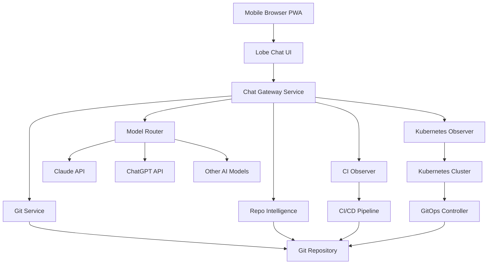
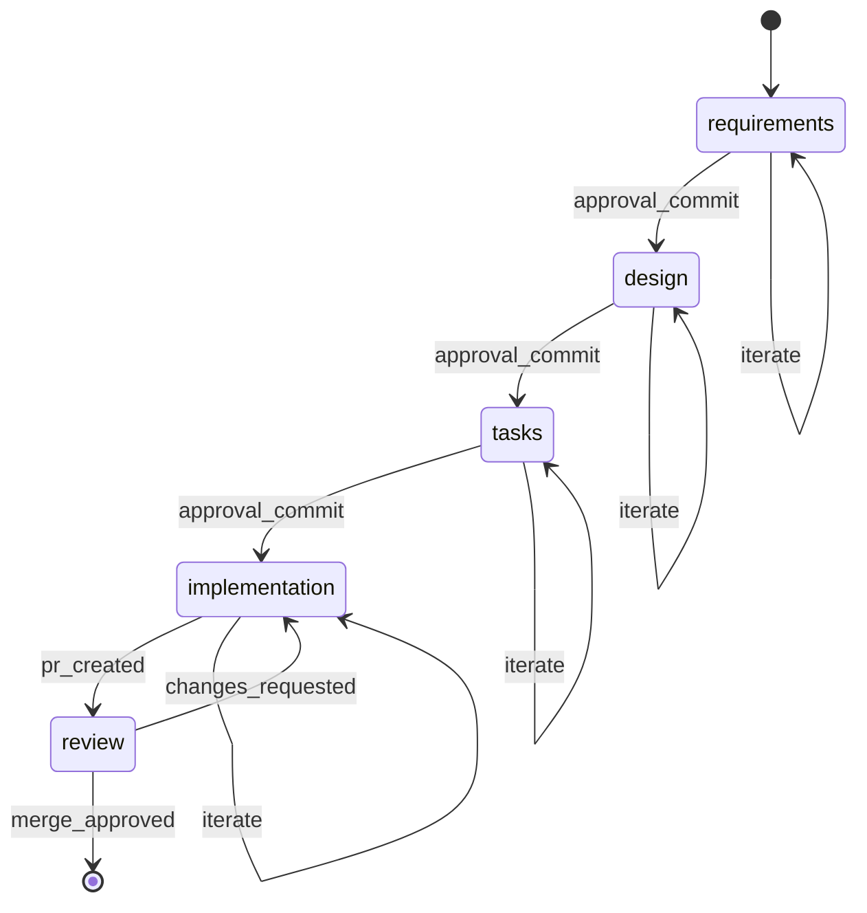

# Design Document

## Overview

The Mobile AI Development Gateway is a cloud-native system that enables mobile-first, AI-assisted software development while enforcing structured development lifecycle guardrails. The system uses Git as the single source of truth, Lobe Chat as the mobile interface, and a custom gateway service to orchestrate AI models, enforce lifecycle rules, and manage project context.

The system enables developers to build complete software projects from mobile devices through a chat interface, while maintaining strict governance, security, and quality controls through automated guardrails and explicit approval workflows.

## Architecture

### High-Level Architecture



### Component Responsibilities

**Lobe Chat (UI Layer)**
- Mobile-optimized Progressive Web App
- Chat interface and session management
- Plugin host for gateway integration
- Markdown rendering and diff visualization
- One-tap approval actions

**Chat Gateway Service (Control Layer)**
- Authentication and authorization
- Project context loading and isolation
- Lifecycle stage enforcement
- AI model routing and capability restriction
- Git operations coordination

**Model Router (AI Layer)**
- Multi-model support and routing
- Request/response transformation
- Model-specific optimization
- Usage tracking and logging

**Git Service (State Layer)**
- Repository content access
- Branch and pull request management
- Commit creation with structured metadata
- Protected branch policy enforcement

**Repo Intelligence (Analysis Layer)**
- Semantic code understanding
- Diff-only code generation
- Code explanation and documentation
- Repository structure analysis

## Components and Interfaces

### Chat Gateway Service

**Core Interfaces:**
- `/api/chat` - Main chat endpoint with project context
- `/api/projects` - Project discovery and selection
- `/api/lifecycle` - Stage transitions and approvals
- `/api/health` - Service health and status

**Internal Components:**
- `AuthenticationManager` - Token validation and user context
- `ProjectContextLoader` - Git-based context loading
- `LifecycleEnforcer` - Stage-based capability restriction
- `ModelRouter` - AI model selection and routing
- `GitOperationsManager` - Repository interactions

### Project Context Structure

#### Single Project Repository
For repositories containing a single project, the `.ai/` directory is placed at the repository root:

```
repo-root/
├── .ai/
│   ├── project.yaml      # Project metadata and configuration
│   ├── state.yaml        # Current lifecycle stage and status
│   ├── requirements.md   # Project requirements (EARS format)
│   ├── design.md         # Technical design document
│   ├── tasks.yaml        # Implementation task breakdown
│   ├── decisions.md      # Architecture decision records
│   └── constraints.md    # Project-specific constraints and rules
├── src/
└── other-project-files...
```

#### Multi-Project Mono-Repository
For mono-repositories containing multiple projects, each project maintains its own `.ai/` directory within its project subdirectory:

```
mono-repo-root/
├── projects/
│   ├── project-a/
│   │   ├── .ai/
│   │   │   ├── project.yaml
│   │   │   ├── state.yaml
│   │   │   ├── requirements.md
│   │   │   ├── design.md
│   │   │   ├── tasks.yaml
│   │   │   ├── decisions.md
│   │   │   └── constraints.md
│   │   └── src/
│   └── project-b/
│       ├── .ai/
│       │   ├── project.yaml
│       │   ├── state.yaml
│       │   ├── requirements.md
│       │   ├── design.md
│       │   ├── tasks.yaml
│       │   ├── decisions.md
│       │   └── constraints.md
│       └── src/
└── shared/
```

#### Project Discovery and Identification
The Gateway discovers projects by:
1. Scanning for `.ai/project.yaml` files within the repository
2. Using the directory containing `.ai/` as the project root
3. Loading project scope from `project.yaml` to determine accessible files
4. Enforcing context isolation based on the defined `scope.included_paths` and `scope.excluded_paths`
5. Supporting flexible project boundaries that can include shared resources while maintaining security

#### Project Scope Management
Each project defines its accessible file scope through:
- **Included Paths**: Glob patterns defining files the project can read and modify
- **Excluded Paths**: Glob patterns defining files to exclude even if matched by included paths
- **Default Scope**: If no scope is defined, defaults to the project's `.ai/` directory and its parent directory
- **Validation**: The Gateway validates all AI operations against the defined scope before execution

### Lifecycle State Machine



## Data Models

### Project Configuration (project.yaml)

```yaml
name: string
path: string           # Relative path from repo root (e.g., "projects/project-a")
owner: string
description: string
scope:
  included_paths:      # Files/directories this project can read and modify
    - "projects/project-a/**"     # Project's own directory
    - "shared/common/**"          # Shared libraries
    - "config/project-a.yaml"     # Project-specific config
    - "docs/project-a/**"         # Project documentation
  excluded_paths:      # Paths to exclude even if in included_paths
    - "shared/common/secrets/**"  # Sensitive shared files
    - "projects/*/node_modules/**" # Generated files
ai_models:
  primary: string      # e.g., "claude-3-5-sonnet"
  fallback: string     # e.g., "gpt-4"
  specialized:
    code_generation: string
    documentation: string
guardrails:
  max_files_per_diff: integer
  require_tests: boolean
  protected_paths: [string]
lifecycle:
  auto_transitions: boolean
  required_approvers: [string]
```

### State Management (state.yaml)

```yaml
stage: string          # requirements|design|tasks|implementation|review
last_transition: timestamp
context:
  current_branch: string
  active_pr: string
  last_ai_action: timestamp
```

**Approval Tracking**: Approvals are tracked through Git commit history using structured commit messages and trailers. The Gateway infers approval status by analyzing commits that modify `state.yaml` and contain approval metadata in commit messages or trailers.

### AI Capability Matrix

| Stage | Text Generation | Repo Read | Diff Generation | PR Creation | K8s Read | CI Read |
|-------|----------------|-----------|-----------------|-------------|----------|---------|
| requirements | ✅ | ❌ | ❌ | ❌ | ❌ | ❌ |
| design | ✅ | ✅ | ❌ | ❌ | ❌ | ❌ |
| tasks | ✅ | ✅ | ❌ | ❌ | ❌ | ❌ |
| implementation | ✅ | ✅ | ✅ | ✅ | ✅ | ✅ |
| review | ✅ | ✅ | ❌ | ❌ | ✅ | ✅ |

## Correctness Properties

*A property is a characteristic or behavior that should hold true across all valid executions of a system—essentially, a formal statement about what the system should do. Properties serve as the bridge between human-readable specifications and machine-verifiable correctness guarantees.*

### Property 1: Lifecycle Stage Enforcement
*For any* AI request and current project state, the gateway should only allow capabilities that are permitted for the current lifecycle stage
**Validates: Requirements 3.2, 4.1-4.5**

### Property 2: Project Context Isolation
*For any* two different projects accessed in sequence, the AI context should contain no information from the previous project
**Validates: Requirements 5.1-5.4**

### Property 3: Project Scope Enforcement
*For any* file access request, the gateway should only allow access to files that match the project's included paths and do not match any excluded paths
**Validates: Requirements 5.5, 5.6**

### Property 4: Git State Consistency
*For any* project state transition, the state.yaml file should accurately reflect the current lifecycle stage after the transition commit
**Validates: Requirements 2.2, 2.3**

### Property 5: Approval Immutability
*For any* approved artifact, subsequent modifications should be rejected unless the lifecycle is explicitly reset
**Validates: Requirements 3.4**

### Property 6: Authentication Token Validity
*For any* gateway request, access should be granted only when a valid, non-expired authentication token is provided
**Validates: Requirements 6.1, 6.2**

### Property 7: Diff-Only Code Generation
*For any* AI-generated code change, the output should be in diff format and should not include direct file modifications
**Validates: Requirements 4.6, 7.1**

### Property 8: Secret Isolation
*For any* AI model interaction, no secrets or sensitive configuration should be included in the request or response
**Validates: Requirements 6.3, 6.5**

### Property 9: CI Validation Enforcement
*For any* invalid lifecycle transition or non-compliant change, the CI pipeline should block the change and prevent progression
**Validates: Requirements 9.1-9.5**

## Error Handling

### Authentication Errors
- **Invalid Token**: Return 401 with token refresh instructions
- **Expired Token**: Return 401 with re-authentication flow
- **Insufficient Permissions**: Return 403 with required permission details

### Lifecycle Violations
- **Stage Restriction**: Return 400 with current stage and allowed capabilities
- **Approval Required**: Return 409 with approval workflow instructions
- **Invalid Transition**: Return 400 with valid transition options

### Git Operation Errors
- **Repository Access**: Return 404 with repository configuration help
- **Branch Protection**: Return 403 with protected branch policy details
- **Merge Conflicts**: Return 409 with conflict resolution guidance

### AI Model Errors
- **Model Unavailable**: Fallback to secondary model with user notification
- **Rate Limiting**: Queue request with estimated retry time
- **Invalid Response**: Log error and request user to retry with different model

### System Errors
- **Service Unavailable**: Return 503 with retry-after header
- **Configuration Error**: Return 500 with administrator contact information
- **Data Corruption**: Attempt recovery from Git history, escalate if needed

## Testing Strategy

### Dual Testing Approach

The system requires both unit testing and property-based testing to ensure comprehensive coverage:

**Unit Tests:**
- Verify specific examples and edge cases
- Test integration points between components
- Validate error conditions and recovery mechanisms
- Focus on concrete scenarios and known failure modes

**Property-Based Tests:**
- Verify universal properties across all inputs
- Test lifecycle enforcement with randomized project states
- Validate context isolation with multiple concurrent projects
- Ensure security properties hold across all request patterns

### Property-Based Testing Configuration

- **Framework**: Use Hypothesis (Python) for property-based testing
- **Iterations**: Minimum 100 iterations per property test
- **Test Tagging**: Each property test must reference its design document property
- **Tag Format**: `# Feature: mobile-ai-dev, Property {number}: {property_text}`

### Testing Layers

**Unit Testing:**
- Gateway service components (authentication, routing, lifecycle enforcement)
- Git operations (branch creation, PR management, commit validation)
- Model router (request transformation, fallback logic)
- Project context loading (state parsing, capability mapping)

**Integration Testing:**
- End-to-end chat workflows through gateway
- Git service integration with repository operations
- AI model integration and response handling
- Kubernetes observability data collection

**Acceptance Testing:**
- Complete mobile development workflows
- Multi-project context isolation validation
- Lifecycle compliance across full project development
- Security and authentication flow validation

### Test Data Management

- **Project Fixtures**: Standardized test projects with known states
- **Git Repository Mocking**: Isolated test repositories for each test case
- **AI Model Mocking**: Deterministic responses for consistent testing
- **Kubernetes Mocking**: Simulated cluster state for observability testing