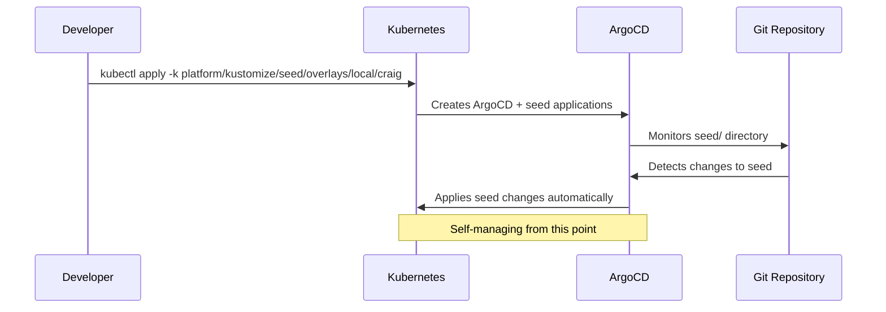

# Mono Repository Structure Design

## Overview

This design establishes a clear, consistent structure for the mono repository that houses multiple platform capabilities including Backstage (developer portal), Image Factory (container lifecycle management), and EDA Mesh (event-driven architecture). The design implements a self-managing seed mechanism that enables GitOps management of the platform infrastructure itself, along with branch targeting capabilities for isolated feature development.

## Architecture

### High-Level Structure

```
├── backstage/              # Backstage capability (complete)
│   ├── app/                # Backstage application (from apps/backstage/)
│   │   ├── packages/       # Backstage packages and plugins
│   │   ├── plugins/        # Custom plugins (image-factory, etc.)
│   │   └── app-config.yaml # Backstage configuration
│   ├── kustomize/          # Backstage Kubernetes configs
│   └── README.md           # Backstage documentation
├── image-factory/          # Image Factory capability (complete)
│   ├── app/                # Docker service (from apps/image-factory/)
│   │   ├── app.py          # Python Flask application
│   │   └── pyproject.toml  # Python dependencies
│   ├── state/              # Image state management
│   ├── scripts/            # Operational scripts
│   ├── images.yaml         # Image configuration
│   ├── cdk8s/              # Infrastructure as code (from cdk8s/image-factory/)
│   │   ├── main.py         # CDK8s infrastructure definitions
│   │   └── pyproject.toml  # CDK8s dependencies
│   └── README.md           # Image Factory documentation
├── eda/                    # Event-Driven Architecture capability (complete)
│   ├── mesh/               # EDA mesh business logic
│   │   ├── producers/      # Event producers
│   │   ├── consumers/      # Event consumers
│   │   ├── services/       # Platform services
│   │   └── lobs/           # Line of business applications
│   ├── kustomize/          # EDA Kubernetes configs (mesh, confluent, etc.)
│   ├── helm/               # EDA Helm charts (mesh-consumer, mesh-lob, etc.)
│   └── README.md           # EDA capability documentation
├── apps/                   # Supporting/development applications
│   ├── e2e-test-runner/    # End-to-end testing utilities
│   └── uv/                 # UV service application
├── platform/               # Shared platform infrastructure
│   ├── kustomize/          # Shared Kubernetes configs
│   │   ├── _common/        # Common Kustomize resources
│   │   ├── seed/           # Consolidated bootstrap configuration
│   │   ├── central-secret-store/ # Secret management
│   │   └── kargo/          # Kargo deployment configs
│   └── cdk8s/              # CDK8s infrastructure code
└── seed/                   # DEPRECATED - to be removed after consolidation
```

### Self-Managing Seed Architecture

The repository implements a self-managing seed mechanism that provides:

1. **Manual Bootstrap**: Initial deployment via `kubectl apply -k platform/kustomize/seed/overlays/{environment}`
2. **Self-Management**: The seed creates ArgoCD applications that manage the consolidated seed directory itself
3. **Branch Targeting**: All applications can track specific Git branches for isolated development
4. **Environment Overlays**: Support for environment-specific configurations (local/pi, local/craig, production)

### Bootstrap Flow



## Components and Interfaces

### Branch Targeting Mechanism

The repository implements a branch targeting system that allows all ArgoCD applications to track a specific Git branch for isolated development. The enhanced mechanism supports both `targetRevision` updates and helm parameter updates using the same value:

```yaml
# platform/kustomize/_common/components/argocd-branch-targetrevision/kustomization.yaml
apiVersion: kustomize.config.k8s.io/v1alpha1
kind: Component

replacements:
  # Update targetRevision for git sources
  - source:
      kind: ConfigMap
      name: argocd-branch-targetrevision
      fieldPath: data.targetRevision
    targets:
      - select:
          kind: Application
          labelSelector: "repo=argocd-eda,argocd-branch-targetrevision=true,argocd-branch-targetrevision-strategy notin (multisource),source-type!=helm"
        fieldPaths:
          - spec.source.targetRevision
      - select:
          kind: Application
          labelSelector: "repo=argocd-eda,argocd-branch-targetrevision=true,argocd-branch-targetrevision-strategy in (multisource),source-type!=helm"
        fieldPaths:
          - spec.sources.*.targetRevision
      - select:
          kind: ApplicationSet
          labelSelector: "repo=argocd-eda,argocd-branch-targetrevision=true,argocd-branch-targetrevision-strategy notin (multisource),source-type!=helm"
        fieldPaths:
          - spec.generators.0.git.revision
          - spec.template.spec.source.targetRevision
      - select:
          kind: ApplicationSet
          labelSelector: "repo=argocd-eda,argocd-branch-targetrevision=true,argocd-branch-targetrevision-strategy in (multisource),source-type!=helm"
        fieldPaths:
          - spec.generators.*.git.revision
          - spec.template.spec.sources.*.targetRevision
  
  # Update helm parameters for branch targeting (using same targetRevision value)
  - source:
      kind: ConfigMap
      name: argocd-branch-targetrevision
      fieldPath: data.targetRevision
    targets:
      - select:
          kind: Application
          labelSelector: "repo=argocd-eda,argocd-branch-targetrevision=true,source-type=helm"
        fieldPaths:
          - spec.source.helm.parameters.[name=feature_branch].value
      - select:
          kind: ApplicationSet
          labelSelector: "repo=argocd-eda,argocd-branch-targetrevision=true,source-type=helm"
        fieldPaths:
          - spec.template.spec.source.helm.parameters.[name=feature_branch].value
```

**Usage in Overlays:**
```yaml
# platform/kustomize/seed/overlays/local/craig/kustomization.yaml
components:
  - ../../../_common/components/argocd-branch-targetrevision

configMapGenerator:
  - name: argocd-branch-targetrevision
    behavior: replace
    literals:
      - targetRevision=feature/backstage-events
```

### Consolidated Seed Structure

```
platform/kustomize/seed/
├── argocd/                         # ArgoCD installation and configuration
│   ├── argocd-namespace.yaml       # ArgoCD namespace
│   ├── argocd-config-map.yaml      # ArgoCD configuration
│   ├── argocd-projects.yaml        # ArgoCD projects
│   └── kustomization.yaml          # ArgoCD resources
├── backstage/                      # Backstage applications
│   ├── backstage-app.yaml          # Main Backstage application
│   ├── backstage-kargo-app.yaml    # Backstage Kargo integration
│   └── kustomization.yaml          # Backstage applications
├── eda/                           # EDA applications  
│   ├── eda-mesh-app.yaml          # EDA mesh application
│   └── kustomization.yaml          # EDA applications
├── image-factory/                 # Image Factory applications
│   ├── image-factory-app.yaml     # Image Factory application
│   └── kustomization.yaml          # Image Factory applications
├── supporting-applications/       # Supporting applications
│   ├── kargo-app.yaml             # Kargo application
│   ├── central-secret-store-app.yaml # Secret management
│   ├── cert-manager-app.yaml      # Certificate management
│   ├── confluent-app.yaml         # Confluent Kafka platform
│   ├── kafka-app.yaml             # Open source Kafka
│   └── kustomization.yaml          # Supporting applications
├── kustomization.yaml             # Main seed kustomization
└── overlays/                      # Environment-specific configs
    ├── local/
    │   ├── pi/                    # Pi environment (full capabilities)
    │   │   └── kustomization.yaml # Includes all components + branch targeting
    │   └── craig/                 # Craig environment (no Image Factory)
    │       └── kustomization.yaml # Excludes Image Factory + branch targeting
    └── production/                # Production environment (core only)
        └── kustomization.yaml     # Core components only
```

### Messaging Infrastructure Components

The platform offers multiple messaging infrastructure options to support demonstrating different technologies, use cases and environment constraints:

#### Confluent Kafka Platform
- **Purpose**: Enterprise-grade Kafka platform with additional tooling and management capabilities
- **Deployment**: ArgoCD application pointing to `eda/kustomize/confluent/`
- **Target Environments**: Development and testing environments where enterprise features are beneficial
- **Configuration**: Kustomize-based configuration with ingress for management interfaces

#### Open Source Kafka
- **Purpose**: Lightweight, single-node Kafka deployment for development and testing
- **Deployment**: ArgoCD application using upstream Helm charts
- **Target Environments**: Resource-constrained development environments
- **Configuration**: Minimal configuration suitable for local development workflows

Both messaging platforms are managed as supporting applications, allowing environment overlays to selectively include them based on requirements and resource constraints.

### CI/CD Testing Architecture

The repository implements a distributed testing approach that enables efficient CI/CD pipelines while maintaining local development parity:

#### Test Level Organization
```
component/
├── src/                    # Source code
├── tests/                  # Only test types the component needs
│   ├── unit/              # Fast tests, no dependencies (optional)
│   ├── integration/       # Medium speed, internal deps (optional)
│   └── acceptance/        # Slow tests, external deps (optional)
├── Taskfile.yaml          # Component-specific test tasks
└── README.md              # Testing documentation
```

#### Component-Specific Testing
Each component defines only the test tasks it needs:
- `task test:unit` - Fast unit tests (if component has unit tests)
- `task test:integration` - Integration tests (if component has integration tests)
- `task test:acceptance` - End-to-end acceptance tests (if component has acceptance tests)
- `task test:all` - Complete test suite for that component

#### CI/CD Integration Strategy
- **Local Parity**: Same commands run locally and in CI/CD
- **Path-Based Selective Execution**: Use GitHub Actions `paths:` semantics to trigger tests only for changed components
- **Composable Tests**: Each test level can be run independently
- **Minimal Centralization**: CI/CD workflows delegate to component-specific tasks
- **Component Autonomy**: Each component defines its own test structure and requirements

### Application Structure Standards

Each application in `apps/` follows consistent patterns:
- **Source code** in language-appropriate structure
- **Tests** co-located with source using `.test.{ext}` suffix
- **README.md** explaining the application purpose and setup
- **Dockerfile** for containerization
- **Configuration files** in root or `config/` directory

### Infrastructure Structure Standards

Each service in `kustomize/` follows Kustomize patterns:
- **base/** directory with core resource definitions
- **overlays/** directory for environment-specific modifications
- **kustomization.yaml** files defining resource composition
- **README.md** explaining the service and deployment

## Data Models

### Repository Metadata

```yaml
# .repo-metadata.yaml (new file)
repository:
  name: "argocd-eda"
  type: "mono-repo"
  capabilities:
    - name: "backstage"
      type: "capability"
      path: "backstage"
      infrastructure: "backstage/kustomize"
      description: "Internal developer catalog and portal"
      production: true
    - name: "image-factory"
      type: "capability"
      path: "image-factory"
      infrastructure: "image-factory/kustomize"
      description: "Container lifecycle management system"
      production: true
    - name: "eda"
      type: "capability"
      path: "eda"
      infrastructure: "eda/kustomize"
      description: "Event-driven architecture platform"
      production: true
  supporting_apps:
    - name: "e2e-test-runner"
      path: "apps/e2e-test-runner"
      description: "End-to-end testing utilities"
      production: false
    - name: "uv"
      path: "apps/uv"
      description: "UV service application"
      production: false
  bootstrap:
    command: "kubectl apply -k platform/kustomize/seed/overlays/{environment}"
    environments:
      local:
        pi: "kubectl apply -k platform/kustomize/seed/overlays/local/pi/"
        craig: "kubectl apply -k platform/kustomize/seed/overlays/local/craig/"
      production: "kubectl apply -k platform/kustomize/seed/overlays/production/"
```

### ArgoCD Application Template

```yaml
# Template for all ArgoCD applications
apiVersion: argoproj.io/v1alpha1
kind: Application
metadata:
  name: ${APP_NAME}
  namespace: argocd
  labels:
    repo: argocd-eda
    capability: ${CAPABILITY}
spec:
  project: eventing
  source:
    repoURL: https://github.com/craigedmunds/argocd-eda
    path: kustomize/${APP_NAME}
    targetRevision: main
  destination:
    server: https://kubernetes.default.svc
    namespace: ${TARGET_NAMESPACE}
  syncPolicy:
    syncOptions:
      - CreateNamespace=true
    automated:
      prune: true
      selfHeal: true
```

## Correctness Properties

*A property is a characteristic or behavior that should hold true across all valid executions of a system-essentially, a formal statement about what the system should do. Properties serve as the bridge between human-readable specifications and machine-verifiable correctness guarantees.*

### Property Reflection

After reviewing the prework analysis, several properties can be consolidated:
- Properties 1.2, 1.3, 1.4, 1.5 all relate to structural consistency and can be combined into comprehensive structural validation properties
- Properties 2.2, 2.3, 2.4, 2.5 all relate to seed configuration correctness and can be combined
- Properties 2.6, 2.7, 2.8 all relate to self-managing seed behavior and can be combined
- Properties 5.1, 5.2, 5.3, 5.4, 5.5 all relate to branch targeting functionality and can be combined

**Property 1: Repository Structure Consistency**
*For any* major directory in the repository, it should follow consistent organizational patterns with appropriate Kustomize base/overlay structure, consistent naming conventions, co-located tests, and README documentation
**Validates: Requirements 1.2, 1.3, 1.4, 1.5**

**Property 2: Seed Configuration Completeness**
*For any* environment overlay, the seed should contain all necessary ArgoCD applications without duplication, include all bootstrap resources, and support environment-specific variations
**Validates: Requirements 2.2, 2.3, 2.4, 2.5**

**Property 3: Self-Managing Seed Behavior**
*For any* seed deployment, applying the seed should create ArgoCD applications that manage the seed directory itself, and subsequent changes to seed configuration should be automatically detected and applied by ArgoCD
**Validates: Requirements 2.6, 2.7, 2.8**

**Property 4: Branch Targeting Functionality**
*For any* ArgoCD application labeled with repo=argocd-eda, when a target revision ConfigMap is configured, the application should use the specified target revision regardless of whether it's a single-source, multi-source, Application, or ApplicationSet resource, and helm applications should have their feature_branch parameter updated to match the target revision
**Validates: Requirements 5.1, 5.2, 5.3, 5.4, 5.5, 5.6, 5.7, 5.8**

**Property 5: Component Documentation Linking**
*For any* major component, its documentation should include links to detailed README files and relevant specifications
**Validates: Requirements 3.2**

**Property 6: Overlay Pattern Support**
*For any* service with multiple environments, it should support independent deployment through properly structured overlay patterns
**Validates: Requirements 4.2**

**Property 7: Messaging Infrastructure Options**
*For any* messaging infrastructure deployment, the system should provide both enterprise (Confluent) and open source Kafka options as supporting applications
**Validates: Requirements 6.1, 6.2**

**Property 8: Kafka Configuration Appropriateness**
*For any* open source Kafka deployment, the configuration should specify single-node setup suitable for development environments
**Validates: Requirements 6.3**

**Property 9: Selective Messaging Deployment**
*For any* environment overlay, it should be able to selectively include or exclude messaging infrastructure components based on environment requirements
**Validates: Requirements 6.4**

**Property 10: Messaging Application Consistency**
*For any* messaging infrastructure ArgoCD application, it should follow the same structural patterns and labeling conventions as other supporting applications
**Validates: Requirements 6.5**

**Property 11: Test Level Organization**
*For any* component with tests, it should organize tests into unit, integration, and acceptance levels with appropriate directory structure and clear separation of dependencies
**Validates: Requirements 7.1**

**Property 12: Local-CI/CD Test Parity**
*For any* component with tests, the Taskfile commands used for local testing should be the same as those referenced in CI/CD pipeline configurations
**Validates: Requirements 7.2**

**Property 13: Component Test Isolation**
*For any* component, its test execution should be independent and not require running tests from other components to validate its functionality
**Validates: Requirements 7.3**

**Property 14: Decentralized Test Configuration**
*For any* component with tests, all test configuration and execution logic should be located within the component directory rather than in centralized CI/CD workflow files
**Validates: Requirements 7.4**

**Property 15: Minimal Centralized Workflows**
*For any* CI/CD workflow file, it should delegate to component-specific test processes rather than containing inline test logic, keeping centralized workflow files minimal
**Validates: Requirements 7.5**

**Property 16: Composable Test Execution**
*For any* component with tests, it should provide separate, independently executable tasks for unit tests, integration tests, and acceptance tests
**Validates: Requirements 7.6**

## Error Handling

### Migration Error Scenarios

1. **ArgoCD Application Conflicts**
   - **Scenario**: Existing applications conflict during consolidation
   - **Resolution**: Pause existing applications, apply consolidated structure, resume with new paths

2. **Missing Resources**
   - **Scenario**: Resources missing after consolidation
   - **Resolution**: Validate all resources exist in consolidated structure before migration

3. **Overlay Conflicts**
   - **Scenario**: Environment overlays conflict with base configuration
   - **Resolution**: Use Kustomize validation to ensure overlay compatibility

### Documentation Validation

1. **Missing README Files**
   - **Detection**: Automated checks for README presence in major directories
   - **Resolution**: Generate template README files with component descriptions

2. **Broken Links**
   - **Detection**: Link validation in documentation
   - **Resolution**: Update links to point to correct locations after consolidation

## Testing Strategy

### Unit Testing
- **Repository Structure Validation**: Tests to verify directory organization follows standards
- **Kustomize Configuration Tests**: Validate that Kustomize builds succeed for all overlays
- **Documentation Link Tests**: Verify all internal links in documentation are valid

### Property-Based Testing
- **Structural Consistency Properties**: Generate random directory structures and validate they follow organizational patterns
- **Seed Configuration Properties**: Generate various environment configurations and validate completeness
- **Overlay Pattern Properties**: Generate overlay combinations and validate they produce valid Kubernetes resources

### Integration Testing
- **Bootstrap Process Testing**: Test complete cluster bootstrap from consolidated seed
- **ArgoCD Application Sync Testing**: Verify all applications sync successfully after consolidation
- **Cross-Component Integration**: Test that applications can discover and interact with each other

### End-to-End Testing
- **Complete Platform Deployment**: Deploy entire platform from consolidated structure
- **Multi-Environment Testing**: Validate different environment overlays work correctly
- **Documentation Navigation**: Test that documentation provides clear navigation paths between components

The testing approach will use **pytest** for Python components and **bash/kubectl** for Kubernetes validation, with property-based testing implemented using **Hypothesis** for Python tests and **custom generators** for Kubernetes resource validation.