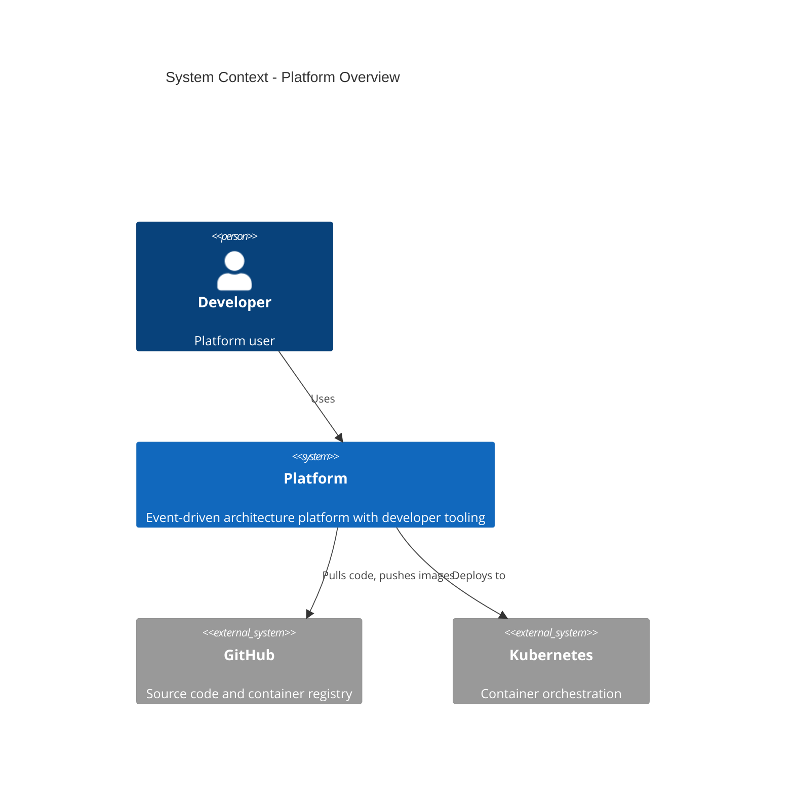
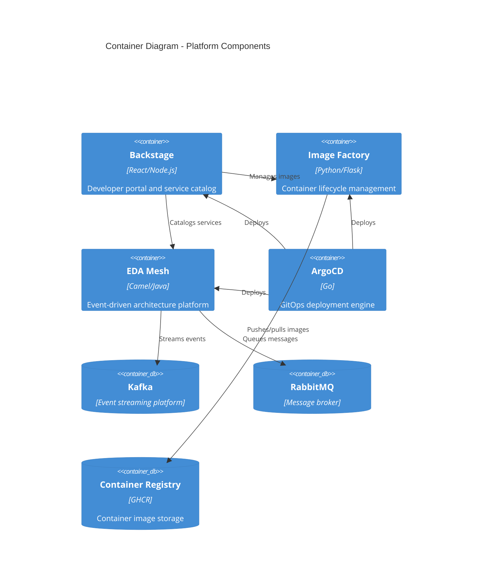

# Platform Mono Repository

This mono repository contains a comprehensive platform implementation featuring event-driven architecture, developer tooling, and container lifecycle management, all orchestrated through GitOps practices.

## Architecture Overview





## Platform Capabilities

### 🏗️ [Backstage](./backstage/README.md) - Developer Portal
Internal developer catalog and portal providing unified interface for discovering, understanding, and managing software components.

**Key Features:**
- Service catalog with custom plugins
- Software templates for scaffolding
- Documentation hub with TechDocs
- Integration with Image Factory and EDA components

### 🏭 [Image Factory](./image-factory/README.md) - Container Lifecycle Management
Automated container image building, testing, and deployment system with GitOps integration.

**Key Features:**
- Automated building with multi-architecture support
- Kargo-based GitOps pipelines
- State management for base and application images
- Integration with GitHub Container Registry

### 🔄 [EDA Mesh](./eda/README.md) - Event-Driven Architecture
Comprehensive event-driven architecture platform enabling loose coupling through asynchronous messaging.

**Key Features:**
- Apache Kafka for event streaming
- RabbitMQ for reliable messaging
- Camel Karavan visual integration designer
- Microservices with JBang-based integrations

## Repository Structure

```
├── backstage/              # Backstage capability
│   ├── app/                # Backstage application
│   └── kustomize/          # Kubernetes configurations
├── image-factory/          # Image Factory capability
│   ├── app/                # Python Flask service
│   ├── cdk8s/              # Infrastructure as code
│   └── state/              # Image state management
├── eda/                    # Event-Driven Architecture capability
│   ├── mesh/               # Business logic (producers, consumers, services)
│   ├── kustomize/          # Kubernetes configurations
│   └── helm/               # Helm charts
├── platform/               # Shared platform infrastructure
│   └── kustomize/          # Shared Kubernetes configs and seed
└── apps/                   # Supporting applications
    ├── e2e-test-runner/    # Testing utilities
    └── uv/                 # Utility services
```

## Image Factory - Container Lifecycle Management

The Image Factory provides automated container image lifecycle management with the following key features:

### Backstage Integration
- **ManagedImage Entities**: Custom entity type for tracking container images
- **Container Versions Tab**: View and manage image versions from GHCR and Docker Hub
- **GitHub Actions Integration**: Monitor build workflows and trigger rebuilds
- **Copy-to-Clipboard**: Easy access to image references and digests
- **Registry Links**: Direct navigation to container registry pages

### Key Features
- **Semantic Version Filtering**: Shows only meaningful version tags (1.2.3, v0.6.2) while filtering out SHA-based tags
- **Multi-Registry Support**: Works with GitHub Container Registry (GHCR) and Docker Hub
- **Proxy-Based Architecture**: Secure API calls through Backstage backend proxy
- **Real-time Updates**: Refresh capabilities with loading states and error handling

### Architecture Highlights
- **Kargo Integration**: Automated freight promotion and dependency tracking
- **CDK8s Code Generation**: Infrastructure as code for Kubernetes resources
- **Property-Based Testing**: Comprehensive test coverage with correctness properties
- **Event-Driven Rebuilds**: Automatic image rebuilds on base image updates

## Bootstrap Instructions

The platform uses a consolidated seed structure for single-command cluster bootstrap.

### Quick Start

Choose your environment and run the appropriate bootstrap command:

#### Local Development (Pi Environment - Full Capabilities)
```bash
kubectl apply -k platform/kustomize/seed/overlays/local/pi/
```

#### Local Development (Craig Environment - No Image Factory)
```bash
kubectl apply -k platform/kustomize/seed/overlays/local/craig/
```

#### Local Development (Niv Environment - Full Capabilities)
```bash
kubectl apply -k platform/kustomize/seed/overlays/local/niv/
```

#### Production Deployment (Core Capabilities Only)
```bash
kubectl apply -k platform/kustomize/seed/overlays/production/
```

### What Gets Deployed

The bootstrap process creates:
- **ArgoCD**: GitOps deployment engine with configuration
- **Core Capabilities**: Backstage, Image Factory, EDA Mesh (depending on overlay)
- **Supporting Applications**: Kargo, Kyverno, cert-manager, etc. (local environments only)

### Environment Differences

| Component | Pi | Craig | Niv | Production |
|-----------|----|----|-----|------------|
| ArgoCD | ✅ | ✅ | ✅ | ✅ |
| Backstage | ✅ | ✅ | ✅ | ✅ |
| Image Factory | ✅ | ❌ | ✅ | ✅ |
| EDA Mesh | ✅ | ✅ | ✅ | ✅ |
| Supporting Apps | ✅ | ✅ | ✅ | ❌ |
| TLS/Domains | Real domains | nip.io | nip.io | TBD |

Get the admin password:

```bash
kubectl get secret argocd-initial-admin-secret -n argocd -o json | jq '.data.password' -r | base64 -D
```

Or via argocd CLI:

```bash
argocd login --core
argocd admin initial-password -n argocd
```

## 2. Setup Central Secret Store

**IMPORTANT**: All secrets must be created in the central secret store. Never create secrets manually in individual namespaces.

Create the central secret store and policies:

```bash
kubectl apply -k kustomize/central-secret-store/
```

### Required Secrets

Create all secrets in the `central-secret-store` namespace:

#### GitHub Personal Access Token
```bash
kubectl create secret generic github-pat \
  --from-literal=token="$GITHUB_PAT_BUILDTOOLING" \
  --from-literal=username="$GITHUB_BUILD_USERNAME" \
  -n central-secret-store
```

#### GitHub OAuth Credentials
```bash
kubectl create secret generic github-oauth \
  --from-literal=client-id="$GITHUB_BUILD_CLIENTID" \
  --from-literal=client-secret="$GITHUB_BUILD_CLIENTSECRET" \
  -n central-secret-store
```

#### Cloudflare API Token (for cert-manager DNS challenges)
```bash
kubectl create secret generic cloudflare-api-token \
  --from-literal=api-token="$CLOUDFLARE_API_TOKEN" \
  -n central-secret-store
```


**Note**: Secrets will be automatically distributed to target namespaces via Kyverno policies based on namespace labels.

## 3. Get ArgoCD Admin Password

Get the rabbitmq admin user & password:

`kubectl get secret camel-k-mesh-default-user -n camel-k-mesh -o json | jq '.data.username' -r | base64 -D`

`kubectl get secret camel-k-mesh-default-user -n camel-k-mesh -o json | jq '.data.password' -r | base64 -D`

## Working on a feature branch

In order to work on a feature branch of this repo, to avoid impacting others whilst work is in progress:

Create an overlay for the kustomize seed application (e.g. kustomize/seed/overlays/feature-branch-name)

Create an overlay for the EDA mesh application (e.g. eda/kustomize/mesh/overlays/feature-branch-name)

Create an overlay for the root seed application (e.g. seed/overlays/local/craig)

Re-Apply the seed with the overlay:

`kustomize build seed/overlays/local/craig | kubectl apply -f -`

## Kargo

If including kargo, it expects a secret to be pre

# Run this once to create the secret
pass=$(openssl rand -base64 48 | tr -d "=+/" | head -c 32)
echo "Password: $pass"
hashed_pass=$(htpasswd -bnBC 10 "" $pass | tr -d ':\n')
signing_key=$(openssl rand -base64 48 | tr -d "=+/" | head -c 32)

kubectl create secret generic kargo-admin-credentials \
  --from-literal=passwordHash="$hashed_pass" \
  --from-literal=tokenSigningKey="$signing_key" \
  -n central-secret-store


# Backstage

Backstage is used for the service catalogue; the helm charts in the eda create config maps with backstage resources that represent the services, APIs, events and relationships between them.

The source for the backstage app is in backstage/app and this is manually built into a docker image and published to github:

`yarn tsc`

`yarn build:all`

`yarn build-image --tag ghcr.io/craigedmunds/backstage:0.x` (where x is an incrementation from previous)

`docker push ghcr.io/craigedmunds/backstage:0.x`

And then update the version number in 

A custom plugin, catalog-backend-module-eda, provides the "Event" related capabilities.